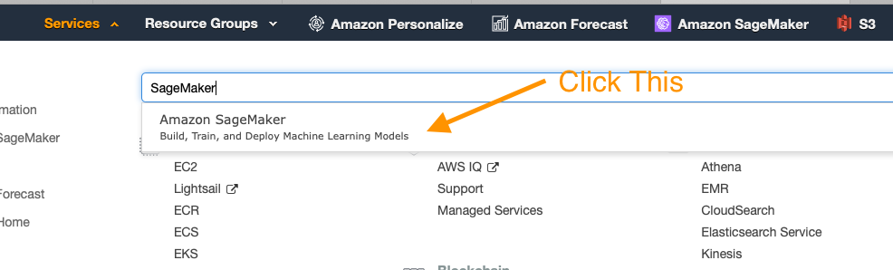
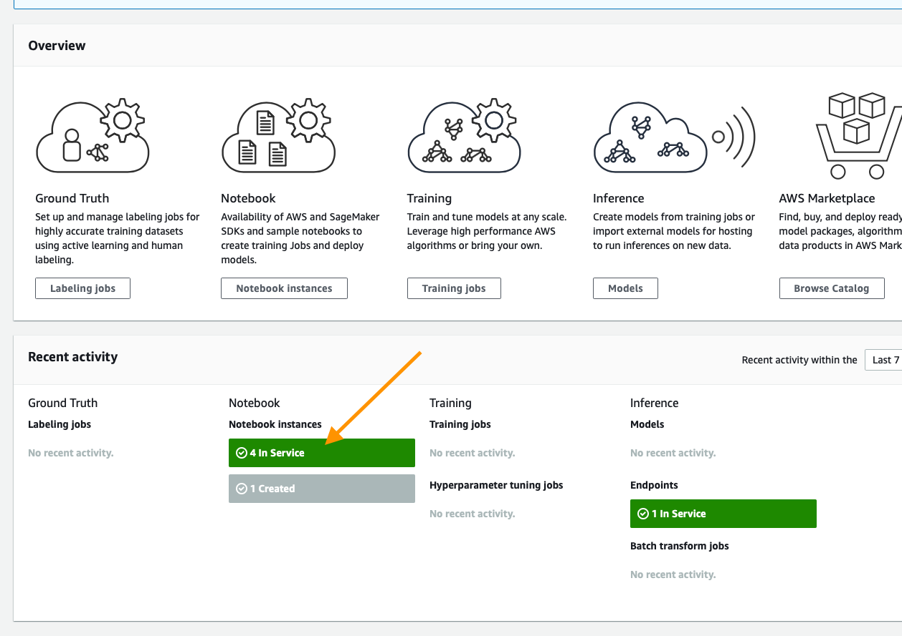

# Personalize POC Guide

Amazon Personalize is a machine learning service that allows you to build and scale recommendation/personalization models in a quick and effective manner. The content below is designed to help you build out your first models for your given use case and makes assumptions that your data may not yet be in an ideal format for Amazon Personalize to use.

This repository assumes a base familiarity with the service and if you have not already done so it is recommended that you use the getting-started material below.

## Introduction to Amazon Personalize

If you are not familiar with Amazon Personalize you can learn more about this tool on these pages:

* [Product Page](https://aws.amazon.com/personalize/)
* [GitHub Sample Notebooks](https://github.com/aws-samples/amazon-personalize-samples)
* [Product Docs](https://docs.aws.amazon.com/personalize/latest/dg/what-is-personalize.html)

## Goals 

By the end of this POC, you should have picked up the following skills:

1. How to map datasets to Amazon Personalize.
1. Which models or recipes are appropriate for which use cases.
1. How to build models in a programmatic fashion.
1. To interpret model metrics.
1. To deploy models in a programmatic fashion.
1. To obtain results from Personalize.

## Completed Example

The notebooks have been scrubbed of all output before usage, however if you'd like to see a fully worked out example of this process, explore the notebooks in the `completed` folder.

## Workshop Version

The notebooks contain all of the code you need to work through a simple POC, but if you are running a workshop, participants will be more engaged if they have to write some of the code themselves. The notebooks in the `workshop` folder have some cells where the participant is asked to complete a challenge.

## Process:

1. Deploying your working environment [see below]
1. Validating and importing user-item-interaction data - 
`01_Validating_and_Importing_User_Item_Interaction_Data.ipynb`
1. Validating and importing item-metadata [in development] - 
`Validating_and_Importing_Item_Metadata.ipynb`
1. Creating and evaluating your first solutions - 
`02_Creating_and_Evaluating_Solutions.ipynb`
1. Importing item / user metadata [in development]
1. Creating and evaluating related metadata solutions [in development]
1. Deploying and interacting with campaigns -
`03_Deploying_Campaigns_and_Interacting.ipynb`
1. Cleaning up the resources on your AWS account - `04_Clean_Up_Resources.ipynb`

That shows the usual order of this process, however, if you are operating this as an assisted 2 day on-site POC, it is recommended that you at least import the user-item-interaction data before arriving in person.

## Deploying Your Working Environment

As mentioned above, the first step is to deploy a CloudFormation template that will perform much of the initial setup work for you. In another browser window or tab, login to your AWS account. Once you have done that, open the link below in a new tab to start the process of deploying the items you need via CloudFormation.

Follow along with the screenshots below if you have any questions about deploying the stack.

### Cloud Formation Wizard

Start by clicking `Next` at the bottom like this:

On this page you have a few tasks:

1. Change the Stack name to something relevant like `PersonalizePOC`
1. Change the Notebook Name (Optional)
1. Alter the VolumeSize for the SageMaker EBS volume, default is 10GB, if your dataset is expected to be larger, please increase this accordingly.

When you are done click `Next` at the bottom.

This page is a bit longer, so scroll to the bottom to click `Next`. All of the defaults should be sufficient to complete the POC, if you have custom requirements, alter as necessary.

Again scroll to the bottom, check the box to enable the template to create new IAM resources and then click `Create Stack`.

For a few minutes CloudFormation will be creating the resources described above on your behalf it will look like this while it is provisioning:

Once it has completed you'll see green text like below indicating that the work has been completed:

Now that your environment has been created go to the service page for SageMaker by clicking `Services` in the top of the console and then searching for `SageMaker` and clicking the service.

From the SageMaker console, scroll until you see the green box indicating now many notebooks you have in service and click that.

On this page you will see a list of any SageMaker notebooks you have running, simply click the `Open JupyterLab` link on the Personalize POC notebook you have created

This will open the Jupyter environment for your POC; think of it as a web based data science IDE if you are not familiar with it. It should automatically open the `PersonalizePOC` folder for you, if not, just click on the folder icon in the browser on the left side of the screen and follow the documentation below to get started with your POC!

## Validating and Importing User-Item-Interaction Data

The core data for every algorithm supported in Amazon Personalize is user-item-interaction data; this notebook will guide you through the process of identifying this data, then formatting it for the service, defining your schema, and lastly importing it. 

Open `01_Validating_and_Importing_User_Item_Interaction_Data.ipynb` and follow along there.

Once you have completed this, you can move on to creating and evaluating your first solutions.

## Validating and Importing Item Metadata

Amazon Personalize has several algorithms that can give you a results with no metadata. However, the HRNN-Metadata algorithm might be an interesting resource to deploy, depending your dataset. In case it is, there is an optional item metadata notebook below. It is similar to the process for users, and the only algorithm that supports either data type is HRNN-Metadata. Additionally in this workshop you will use the metadata to support filters on your recommendations.

Open `02_Validating_and_Importing_Item_Metadata.ipynb` and follow along there to prepare the dataset for the POC/Amazon Personalize.

## Creating and Evaluating Your First Solutions

In Amazon Personalize there is a concept of a solution, which is a trained model based on the data that you've provided to the service. All models are private and no data sharing occurs between accounts or even between dataset groups. This notebook will guide you through the process of training models; aka building a solution for:

* HRNN
* SIMS
* Personalized-Ranking

Something you may notice is that each of these algorithms or recipes solves a critically different problem. The goal is to show you how to build things that address a host of problems from a relatively simple dataset.

Open `03_Creating_and_Evaluating_Solutions.ipynb` and follow along to build these solutions and see their results.

### Deploying Your Campaigns and Filters

Once you have a series of trained solutions the next step is to deploy them. This is done inside `04_Deploying_Campaigns_and_Filters.ipynb`. Here you will learn:

1. Deployment and capacity planning
1. How to create filters based on item metadata
1. How to create filters based on interactions

### Interacting with Campaigns and Filters 

The final operational notebook `05_Interacting_with_Campaigns_and_Filters.ipynb` covers how to get realtime recommendations over all the models that you deployed, as well as interacting with filters and batch processes. Here you will learn:

1. How to interact with a deployed solution (various approaches)
1. Real-time interactions
1. Batch exporting

### Next Steps

Following these notebooks should have left you with a series of working models for your customer. From here, you will look to leverage how the customer accomplishes AB testing today against their goals (coversions, clicks, etc) and then start sending traffic to these models and monitoring those metrics. Over time this should build confidence and will be your path to production at scale.

More content on AB testing coming soon as well.

### Cleaning Up

Finished with the POC? If you want to delete all the resources created in your AWS account while following along with these notebooks, please see the `06_Clean_Up_Resources.ipynb` notebook. It will help you identify all of the Personalize resources deployed in your account and shows you how to delete them.