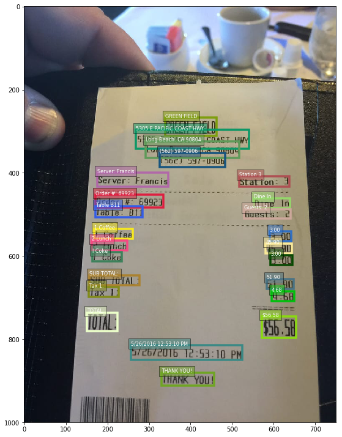
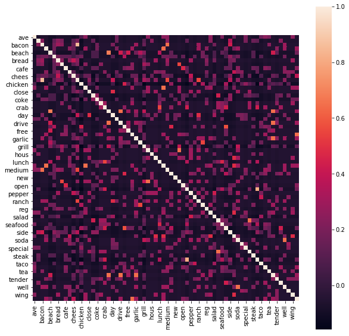

Based on this repo:
* https://github.com/raminetinati/aws-demo-textract-receipts/

# Amazon Textract - Building a Receipt Processing Solution

## Overview

In [May 2019](https://press.aboutamazon.com/news-releases/news-release-details/aws-announces-general-availability-amazon-textract) Amazon announced the General Availability of Amazon Textract, which is a fully managed service that uses machine learning to automatically extract text and data, including from tables and forms, in virtually any document – with no machine learning experience required. In this blog post, we’re going to explore the use of Amazon Textract to build a Receipt Processing Solution, which uses images of different types of receipts, and demonstrates how to apply different methods to process the data.

For this solution, the [code](https://github.com/raminetinati/aws-demo-textract-receipts/) developed illustrates how Data Scientists can use Textract to process, and structured data from documents, and then how to explore that data for further insights using Part of Speech Tagging (POS), Named Entity Recognition (NER), Word Co-occurrence (manual), and Word Embeddings using Amazon SageMaker’s Built in Blazing Text Algorithm. 

By the end of this article, you should have learnt how to use Amazon Textract to ingest multiple images and obtain the results from the API, and how to enrich and analyse the results for processing purposes. We're going to also be examining how to conduct simple Feature Engineering to reduce high cardinality data, and finally, how we can use Amazon SageMaker to build Word Embeddings (Vector Space Representations) of your data.

## Background

### Amazon Textract

>Amazon Textract is a service that automatically extracts text and data from scanned documents. Amazon Textract goes beyond simple optical character recognition (OCR) to also identify the contents of fields in forms and information stored in tables.

Many companies today extract data from documents and forms through manual data entry that’s slow and expensive or through simple optical character recognition (OCR) software that requires manual customization or configuration. Rules and workflows for each document and form often need to be hard-coded and updated with each change to the form or when dealing with multiple forms. If the form deviates from the rules, the output is often scrambled and unusable.

Amazon Textract overcomes these challenges by using machine learning to instantly “read” virtually any type of document to accurately extract text and data without the need for any manual effort or custom code. With Textract you can quickly automate document workflows, enabling you to process millions of document pages in hours. Once the information is captured, you can take action on it within your business applications to initiate next steps for a loan application or medical claims processing. Additionally, you can create smart search indexes, build automated approval workflows, and better maintain compliance with document archival rules by flagging data that may require redaction.

## Building a Solution: Receipt Processing

In order to illustrate the process of using Amazon Textract to build an OCR solution to build a real-world use case, we’re going to focus our efforts on developing a receipt processing solution which can extract data from receipts, independent on their structure and format. This is a common real-world problem which many organisations are facing, and without suitable automated processes, the overheads of manually reading and transcribing receipts can require a substantial number of human resources. 

One of the biggest challenges when building such solutions is being able to interpret the output of a OCR processed document, given that there labels are not available. Let’s take a second to consider why this is technically challenging. If we were to take a trivial example of a receipt processing solution which only had to interpret one type of receipt, from one merchant. For this use case, we could build a solution which has a dictionary of words specific to the products that the merchant sells, and a custom image processing pipeline which can detect the regions in the receipts which correspond to regions in the receipt with known content (e.g. the header, the main itemized section, the Sub-Total. the Total). However, now consider the scenario such as ours, where we are trying to build a solution which can process receipts from different Merchants, the receipts have many different structures and shapes, there is no consistency between content location (e.g. Total vs Header), the dictionary of words used will be extremely vast, and even the meaning of words, or language, may be different. Very quickly the technical scope expands, and no longer can you develop a rule based system, but you need to use data processing and mining techniques to make sense of the data.

For the use case in this article, we’re going to describe the process which a data science team would go through to develop the first stage in the pipeline of digitalizing and consuming the receipts information, which involves using Textract to perform Optical Character Recognition (OCR) on receipts. The process we’re going to cover in this post explores the necessary exploration and experimentation for extracting relevant information from unstructured, unlabelled data.

### Data Science Process

Without going off on a tangent and never returning, let’s think about the data science process that needs to be used when developing a solution such as this. Before jumping into concepts such as Machine Learning, Data Science teams will spent a vast majority of their time looking and manipulating the data sources in order to understand the shape and structure of the data they’re trying to process (or potentially model in the future). This process is highly iterative, and requires both contextual knowledge of the domain (in this case, Merchant data), as well data manipulation and transformation techniques to expose the underlying commonalities and patterns. As we will further in this post, this iterative process involves  adding additional analysis techniques as more information is discovered (For any social scientists out there, this is similar to snowball sampling), and then iterating over the initial analyses which were conducted in order to improve and refine the knowledge about the dataset. As a result, the data science team will end up with many different experiments and findings as the data and methods of analysis improves. Each of these need to be tracked, documented, and then used to help support the underlying business requirement and needs.


### The Dataset

For this demonstration, we’re going to be using a dataset of 200 receipts, which has been made available by [ExpressExpense](https://expressexpense.com/blog/free-receipt-images-ocr-machine-learning-dataset/). The receipts data contains 200 different receipt images, with different backgrounds and types of receipts. This dataset is a great source of input for our solution, as we’re trying to build a processing pipeline with Amazon Textract that can support a wide spectrum of receipt types (e.g. they shouldn’t all come from the same Merchant). An example of the receipts can be seen below.



### Data Enrichment Tools

Data Enrichment is the processing of enhancing a source of data with additional data sources; this can be performed by custom processing of the data, or if available, by using 3rd party data (open or closed). The data enrichment process, can be applied to many different types of data, from images, video, audio, to text, and can be simple enrichments such as adding tags to a data point (e.g. Adding context to a word), or more complex enrichments, such as linking to external data sources, or perhaps to other sources within the data (e.g. constructing a graph of resources).

In our example, we’re going to be using two data enrichment processes in order to add additional knowledge about the content of our receipts, which in turn, will allow us to process the information more efficiently. 


### Part of Speech (POS) Tagging

Part of Speech tagging is the process of marking up a word in a corpus as corresponding to a particular part of speech based on both its definition and its context. which is based on its relationship with other words in the sentence or phrase that it is located in. At its most primitive, POS can be used to perform identification of words as nouns, verbs, adjectives, adverbs, etc.

POS can be extremely useful for text processing, especially when you are trying to find out the context or meaning of a sentence, phrase or paragraph. For more advances uses, POS allows the construction of Parse Trees, which allow for more complex processing and insights. For more information on this, take a look [here](https://en.wikipedia.org/wiki/Parse_tree)


### Named Entity Recognition (NER)

Named-entity recognition (NER) is a sub-task of information extraction that seeks to locate and classify named entity mentioned in unstructured text into pre-defined categories such as person names, organizations, locations, medical codes, time expressions, quantities, monetary values, and percentages.

There are multiple uses of NER across many different domains, from enriching news articles with tags for names, organizations, and locations, to improving our search results and search indexes. As the NER process relies on large corpuses of reference data, usually 3rd party libraries such as [SpaCy](https://spacy.io/) is used. 


##  Solution Walkthrough

In the following section we’re going to walk through the example solution which was build and can be found [here](https://github.com/raminetinati/aws-demo-textract-receipts/). The purpose of this walkthrough is not to give you a line-by-line review of the code (there’s documentation in the Notebook for this), but to demonstrate some of the high-level concepts which have been used for the data exploration and analysis, and how they support the extraction of information from unstructured data sources where the ground truth is not known.

### Step 1. Data Loading and Textract OCR Processing

The first step in our process will be to obtain our data, and then pass it to Amazon Textract to extract the text/words. In order to do this, we will first unzip the receipt images and then upload them to the S3 bucket, which was named in the config files. As we’re currently in experimental mode, the data source will come from a single pool of data (e.g. the tar file in the GitHub repository), however, in the future, it may be that we’re pushing data to S3 from an external of source, which will then be used for further exploration.

For this example, we will use the ```detect_document_text``` [endpoint](https://docs.aws.amazon.com/textract/latest/dg/API_DetectDocumentText.html) available via the Textract API. Documentation can be found [here](https://textract.readthedocs.io/en/stable/). Prior to sending the data to the API, we first need to convert the images to their Byte array representation (a matrix of bytes), which will then be consumed by the Textract ```detect_document_text``` API endpoint.

After invoking the Textract endpoint, we are then returned a JSON response which contains the data(text) found within the image, along with additional metadata, such as the Confidence score of the Word or Line which has been identified, the geometry data which can be used to identify the bounding box, and the relationships with other items identified in the document.

Below is an example of two entries in the response, one showing the LINE entry (one more words), and one for WORD (one word only). As shown in the relationships Array, the detected word *long* has an Id of *703dbf83-ec19-400d-a445-863271b2911c* which is found in the Relationships List of the LINE entry for text *Long Beach. CA 90804*. 


```json
{"BlockType": "LINE",
    "Confidence": 91.95721435546875,
    "Text": "Long Beach. CA 90804",
    "Geometry": {"BoundingBox": {"Width": 0.300077348947525,
      "Height": 0.039210282266139984,
      "Left": 0.38969704508781433,
      "Top": 0.3248765766620636},
     "Polygon": [{"X": 0.39162901043891907, "Y": 0.33458489179611206},
      {"X": 0.6894412636756897, "Y": 0.3248765766620636},
      {"X": 0.6897743940353394, "Y": 0.35538360476493835},
      {"X": 0.38969704508781433, "Y": 0.3640868663787842}]},
    "Id": "e991117e-c0a6-42c3-81ac-3778e41a65a7",
    "Relationships": [{"Type": "CHILD",
      "Ids": ["703dbf83-ec19-400d-a445-863271b2911c",
       "e8c98b04-7a1f-4363-9d6b-221a6d6039a0",
       "1d292d3b-4a8f-43f3-a70d-efde1d9fda85",
       "a938c8b2-cd63-4d3e-b48a-7b9a9e84554c"]}]},
...
{"BlockType": "WORD",
    "Confidence": 84.29407501220703,
    "Text": "Long",
    "Geometry": {"BoundingBox": {"Width": 0.060677558183670044,
      "Height": 0.024492284283041954,
      "Left": 0.3901515007019043,
      "Top": 0.33265504240989685},
     "Polygon": [{"X": 0.39162901043891907, "Y": 0.33458489179611206},
      {"X": 0.45082905888557434, "Y": 0.33265504240989685},
      {"X": 0.44968584179878235, "Y": 0.35537028312683105},
      {"X": 0.3901515007019043, "Y": 0.35714733600616455}]},
    "Id": "703dbf83-ec19-400d-a445-863271b2911c"},
}
```

Now that we have processed each of the images and have a digitalized version of our receipts, we’re now going to shift to processing and enriching this data with additional information to determine whether we can derive more context and meaning with our receipts.

### Step 2. Data Enrichment and Exploration

As discussed earlier in this article, the cleaning-enrichment-exploration is an iterative process which will involve several methods to understand the shape of our data at the micro (per document) and macro (collection of documents) level.

One of the first things that needs to be conducted is deciding whether to use the WORD or LINE elements from the Textract response. For this example we’re going to use the WORD elements in our response, as we don’t want to assume any relationship between our identified text prior to processing it. As there is the `Relationships` Element in our response, we can always reconstruct our data if we wish to do so.

#### Text Pre-processing and Stop Word Removals

If you’re familiar with Natural Language Processing (NLP), then you might be familiar with the pre-processing required to ensure the data is as clean as possible before using it for modelling or other purposes (e.g. Dashboard visualizations). NLP Pre-processing has many steps, including stemming and lemmatization (obtaining the root of the word, e.g. processes, process), as well as removing punctuation, language checking, stop word removal, and tokenization (splitting sentences into words)

One of the most iterative processes in most NLP tasks is the development of the stop words. Stop words are common words in a corpus of text which are not useful for processing and analysis purposes, this they are removed. Common stop words are things like "is", "and", "the". The stripping of these common terms can be performed with libraries such as `nltk` (as we do in our example). However, in real-world use cases, usually domain specific lists are generated to remove words which are common. For our domain, merchant restaurant receipts, we have somewhat of a limited vocabulary which will be consistent across the receipts, these include terms such as "Total", "Server", "Tax", etc. Thus, we need to develop a list of stop words which help reduce the noise in our data. This is an iterative process and requires the data scientists to iteratively process the words and examine the output to measure the effect of removing specific terms. It’s also important to note that there are approaches such as TF-IDF and LDA which can help reduce the need to remove commonly used terms across multiple documents, but in practice, domain stop words has benefits. 

In our example, we have generated a list of 100+ stop words which are commonly used in receipts, and for our task, do not provide added analytical insights. These terms can be found in the `stopwords_custom.txt` document. This list, in combination with the `PortStemmer`, and `nltk`, for the first step in our text pre-processing pipe. Just to reinforce the iterative nature of the NLP process, the initial version of the `process_textract_responses_v1` method was only 19 lines long, 


```python
def process_textract_responses_v1(global_vars, data):
    stop_words = global_vars["stop_words"]
    records_enriched = {}
    for key,response in data.items():
        line_data = []
        confidences = []
        word = ""
        for item in response["Blocks"]:
            if item["BlockType"] == "WORD":                   
                #we need to normalise and remove punctuation.
            	word = item["Text"]
                if (word not in stop_words)==:
                    confidences.append({"word": word, "confidence": item["Confidence"]})
        #now we have the data
        record_data = process_textract_text(line_data, False)
        record_data["word_confidences"] = confidences
        record_data["response_raw"] = response
        records_enriched[key] = record_data
    return records_enriched
records_enriched = process_textract_responses(global_vars, textract_data)
```

However, if we examine the latest version of the method in the notebook, you’ll see that there are a lot more conditional statements and pre-processing steps used before the identified word is added to the processed list of words.

#### Data Enrichment with NLTK and SpaCy

As part of our processing pipeline, we’re using `NLTK` for performing Part-Of-Speech Tagging, and then `spaCy` for Named Entity Recognition. Whilst very simple to use (see below), POS and NER help add context and semantics to the data we’re trying to process. 

```python 
tokens = nltk.word_tokenize(words)
nltk_tagged_tokens = nltk.pos_tag(tokens)
```

Using the above code snipping on a string `This sentence has been processed by NLTK Part of Speech Tagger`, produces an output such as:

```json
[["This", "DT"], ["sentence", "NN"], ["has", "VBZ"], ["been", "VBN"], ["processed", "VBN"], ["by", "IN"], ["NLTK", "NNP"], ["Part", "NNP"], ["of", "IN"], ["Speech", "NNP"], ["Tagger", "NNP"]]
```
In just two lines of code we now have tags for each of the words identified in the image. Similarly, we can apply spaCy to extract recognized entities, with the above string, we would be returned the following:

```json
[["NLTK", "ORG"], ["Speech Tagger", "PRODUCT"]]
```

Based on these results, we can then start to bag our terms into different categories, and start to apply simple processing to the results, based on their tags. For instance, when we identify dates or cardinal values, we can then add some conditional statements, and based on some assumptions), select a value which could represent the total value of the bill, or the date of the transaction. Again, several assumptions are made at this step; take for instance the variable `max_value`, which is used to denote the maximum value found on the receipt. After a few stages of pre-processing and sanity checking, e.g. removing numbers such as barcodes, we take the maximum value as the bill value, however this can be problematic, as some receipts maximum value actually represent the cash which was given to pay the bill, e.g. 20 USD, whereas the actual bill total was only 15.99 USD.


Acknowledging these limitations in our pre-processing and enrichment stages, we're able to proceed to now analyse and further enhance our data in order to use it for other purposes.


#### Boundary Box Analysis

Visual inspection is a great tool to examine the output of Amazon Textract, and whilst you cannot do this at scale (e.g. all receipt images), being able to inspect the OCR results, especially when the confidence levels are low, is important. It's also good practice when performing data exploration and analysis to at some point in the process (earlier the better) to visually inspect the results of the processing, whether this be for text, images, or video.


#### Basic Analysis of Enriched Records

One of the most basic steps we can do to understand the results of our OCR process, is to examine both the data at the Micro (e.g. at the level of each record), and at the Macro (e.g. the dataset as a whole). For each the Micro and Macro, we need to apply different instruments of analysis, and both will provide different insights to how we can use our data.


- Macro Level Analysis: This typically involves looking at distributions of records, from the type of tokens we have, measures of skewness, or depending on the domain of the dataset, aspects such as timeseries or PMD plots. For our domain, we will use this exploratory step to understand the type of tokens we're commonly identifying within our dataset, as well as the distribution of confidence scores across our words. This is going to be an iterative process, as what we're aiming to do here is refine our custom dictionary of words that we don’t want to include. Whilst it is hard to demonstrate how this iterative process happens, it's important to understand that the words in the ```stop_words_custom.txt``` file was not generated on a single pass, rather, it was an iterative process of viewing common words within the dataset, and based on the context of the data, we can keep or remove the words. A good example of this is the word `Server` or `Waiter`, for this domain (Receipt's data), this is going to be a common term, and for the purpose of our task, does not add value. That being said, if the task was to identify receipts where there was a `Server` or `Waiter` involved, then it would be beneficial to keep this term. 

In the ```analyse_records``` method, a series of Macro level inspections on the data are conducted, such as examining the distribution of the confidence scores on the words across all the records, as well as the distribution of max values found, and spread of timestamps.

\Whilst these descriptive stats are quite rough and high-level, they provide some intuition on the processing pipeline we're building, and highlight any major flaws or errors in our steps. Using this visual inspection of the data, we can also refine the dictionary of stop words.

Take for example the output below, we can see that from the top 10 common words, there are perhaps further processing steps required to ensure that we don't have duplicate terms like `0.00` and `$0.00`, or that we need a more refined approach to select the dates, given that there are only 200 records, and we have 211 dates in our table. Again, this is where an iterative approach will pay off, as refining our methods of analysis and pre-processing will allow us to obtain a refined dataset for a given use case.

```sh
Total Non-unique Tokens 7755
Unique Tokens 4819
Top 10 Common Tokens ['0.00', 'chicken', '$0.00', '12.00', 'taco', 'coke', 'chees', 'grill', 'shrimp', 'dinner']
Highest Total Value 827.0 
Lowest Total Value 0.0 
Mean Total Value 67.59 
       max_values
count  200.000000
mean    67.592400
std    103.174735
min      0.000000
25%     18.825000
50%     38.545000
75%     73.265000
max    827.000000
Total Dates Found 211
```

#### Token Co-Occurrence

A simple, yet powerful method to derive insight into a group of documents is to use a term co-occurrence matrix to calculate the co-cogence of n-terms within and across documents. Take for instance the receipts data, we are able to perform simple word counting across documents, and show that *chicken* is a popular word on this. However, we also obtain terms such as *0.00*, which doesn't really provide us much value or insight (perhaps this could be useful for some uses cases). However, what if we were to examine the co-occurrence of two (or n) terms within a given receipt, and then more broadly, the occurrence of that across all documents. This starts to add more meaning to our analysis, no longer are we just observing *chicken* as a common word, but we may be able to see what commonly pairs with chicken, e.g. *chicken*, *watermelon*. From this, one outcome is that we now know something about the relationship between terms: which may be which items are being purchased or sold with each other.

In our notebook, the `token_coocurence` allows us to compute the count of combinations between n-terms, and then filter these terms to a smaller list which is suitable for use in other analyses. A sample output of our term co-occurrence looks like the following:

```sh
term_co-occurencer, count
('parti', 'svrck'), 7
('ice', 'tea'), 6
('chicken', 'rice'), 5
('new', 'york'), 5
('settl', 'tender'), 4
('diet', 'coke'), 4
('avenu', 'side'), 4
('acct', 'auth'), 4
('mexican', 'chicken'), 4
('custom', 'copi'), 4
('ave', 'chicken'), 4
```

Using the output of this term co-occurrence, we can now transform the data into a matrix representation, in order to start to explore whether the receipts maximum value (which has been calculated in the previous stage), can tell us something about the type of items which are being purchases within the receipts.

In order to transform the data, we first need to implement a simple one-hot-encoding strategy to our receipts, which is effectively going to result in a very sparse matrix of receipts x terms, where 0 represents an item is not present, and 1 represent an item being present. If you're familar with TF-IDF, then this operation will mimic the Term-Frequency matrix, however, due to the context of our domain, we will only be looking at unique terms, rather than counts of terms.

For instance, say we have two receipts:

- Receipt A. Items (Coffee, Cake, Chicken)
- Receipt B. Items (Chicken, Salad, Water)

Our new receipt-term matrix will look like the following:

|           | Cake | Chicken | Coffee | Salad | Water |
|-----------|------|---------|--------|-------|-------|
| Recept_A  | 1    | 1       | 1      | 0     | 0     |
| Receipt_B | 0    | 1       | 0      | 1     | 1     |


As a result, we're going to end up with an extremely large sparse matrix of terms. In order to reduce the size, we're going to be using the output of the unique tokens from the `token_coocurence` method, as a filter for terms that we're going to include in our one-hot-encoded matrix. Thus, the parameters that we use for generating and filtering our term co-occurrence is going to directly impact the one-hot-encoded matrix that we generate. 

Once we have filtered the corpus of words against the co-occurrence list, we then want to try and categorize our receipts based on the `max_value` which was generated in the earlier steps. we're going to make some assumptions here, driven by the quartile values of the `max_value` values, as shown in the `analyse_records` method. The `cost_type` method below provides a method to label our receipts.


```python
def cost_type(x):
        lower = 0
        lower_thres = 30
        mid_thresh = 67
        
        if x >= lower and x < lower_thres:
            return 'low_cost'
        if x > lower_thres and x < mid_thresh:
            return 'medium_cost'
        if x > mid_thresh:
            return 'high_cost'
```

Using the above `cost_type` method in the `food_cost_analysis` method, we can now perform analysis at the label level, which will allow us to determine if the max_value of the receipt has any relationship with the type of items listed. Again, as this is a rough method to analyse the data, we're going to need some methods to filter the columns in our matrix/dataframe. In order to do this, we can set a threshold parameter (`pct_not_empty`) to only keep columns where more than x percent of the rows have a value. 

If we refer back to our previous example, say we have a threshold of 50%, then the example would be processed as follows:


|           | Cake | Chicken | Coffee | Salad | Water |
|-----------|------|---------|--------|-------|-------|
| Receipt_A | 1    | 1       | 1      | 0     | 0     |
| Receipt_B | 0    | 1       | 0      | 1     | 1     |
| Receipt_C | 0    | 1       | 1      | 1     | 1     |


Apply a threshold of 50% of rows being 1. Thus the column 'Cake' is dropped.


|           | Chicken | Coffee | Salad | Water |
|-----------|---------|--------|-------|-------|
| Receipt_A | 1       | 1      | 0     | 0     |
| Receipt_B | 1       | 0      | 1     | 1     |
| Receipt_C | 1       | 1      | 1     | 1     |


Using this approach, we're now able to examine the remaining terms from our different categories:

|  Label      | Receipts| Columns| Common Terms | 
|-------------|---------|--------|--------------|
| high_cost   | 58      | 60      | 'asparagu', 'ave', 'avenu', 'beach', 'beef', 'blue', 'blvd', 'brussel', 'burger', 'cab', 'cake', 'chicken', 'chip', 'chop', 'coffe', 'coke', 'custom', 'diet', 'dinner', 'express', 'famili', 'filename', 'fish', 'garlic', 'glass', 'grand', 'grill', 'hous', 'jericho', 'label', 'margarita', 'med', 'mexican', 'new', 'onion', 'onlin', 'open', 'park', 'parti', 'pork', 'qti', 'quesadilla', 'red', 'reg', 'rib', 'rice', 'salad', 'salmon', 'see', 'shrimp', 'side', 'sirloin', 'steak', 'street', 'tea', 'top', 'west', 'white', 'wine', 'york'   |
| medium_cost | 58      | 70      | 'ave', 'avenu', 'bacon', 'bbq', 'beach', 'beef', 'bread', 'burger', 'cafe', 'cake', 'chees', 'cheeseburg', 'chicken', 'chz', 'close', 'coffe', 'coke', 'combo', 'crab', 'cust', 'day', 'dinner', 'drive', 'fajita', 'filename', 'free', 'french', 'garlic', 'glass', 'grill', 'hamburg', 'hous', 'label', 'larg', 'lunch', 'mac', 'medium', 'mexican', 'new', 'onion', 'open', 'parti', 'pepper', 'pollo', 'ranch', 'red', 'reg', 'rice', 'salad', 'sarah', 'seafood', 'shrimp', 'side', 'small', 'soda', 'soup', 'special', 'spinach', 'steak', 'svrck', 'taco', 'take', 'tea', 'tel', 'tender', 'water', 'well', 'west', 'wing', 'www'   | 
| low_cost    | 84      | 29     | 'acct', 'american', 'auth', 'beef', 'cafe', 'chees', 'chicken', 'chip', 'close', 'coffe', 'coke', 'drink', 'drive', 'egg', 'filename', 'free', 'french', 'hot', 'label', 'lunch', 'pay', 'purchas', 'roll', 'street', 'taco', 'take', 'tender', 'type', 'wing'    | 


From our results, we're seeing some overlap between categories, and with some refining of the parameters, we are able to draw out some unique terms which only appear with each of the different groups, e.g. in the high_cost category, we can unique terms such as `sirloin` and `chop`. We can also use the heatmaps to visualise the correlations between terms to identify within a given category, which terms appear to correlate more strongly with each other (which is a measured by the corresponding 0s or 1s in the matrix).



#### Word Embeddings

Another approach is to examine the word embeddings of the text in order to determine relationships between the terms (tokens) within the data. Word2Vec is a popular algorithm used for generating dense vector representations of words in large corpora using unsupervised learning. The resulting vectors have been shown to capture semantic relationships between the corresponding words and are used extensively for many downstream natural language processing (NLP) tasks like sentiment analysis, named entity recognition and machine translation.

For our Word Embeddings approach, we're going to be using Amazon SageMaker's built-in BlazingText algorithm, which is a highly optimized implementations of the Word2vec and text classification algorithms. The Word2vec algorithm is useful for many downstream natural language processing (NLP) tasks, such as sentiment analysis, named entity recognition, machine translation, etc. Text classification is an important task for applications that perform web searches, information retrieval, ranking, and document classification.

For more information about blazingtext check this [out](https://docs.aws.amazon.com/sagemaker/latest/dg/blazingtext.html)

To start things of, we need to transform our tokens in each of the individual records, into one large corpus. It’s important to remember that techniques such as Word2Vec relies on the ordering or neighbouring of terms when constructing our embeddings. This is problematic in our case as we're dealing with terms which first, are based on OCR documents, and secondly come from different document sources (e.g. 200 receipts). 

Once we have converted our data sources into a single larger corpus of words, we can then upload this dataset to Amazon S3 in order to make it accessible to the SageMaker distributed training environment. Both these operations can be found in the `prep_data_form_sagemaker_training` and `upload_corpus_to_s3` methods.

In our example, our data contains the following characters and tokens:

```sh
Total Corpus Size: 8956 Tokens
Total Char Size: 44707 
```

Once the data has been uploaded to S3, we're now ready to set up our BlazingText estimators, configure our hyperparameters, and finally, fit the model with our data.

Let's look at our hyperparameters to understand how they affect the word embeddings, or more specifically, the vectors which are generated.

- mode: there are three modes of operation, `batch_skipgram`, `skipgram`, and `cbow`, and `supervised`. As we're working with an unsupervised exercise, only the first three apply. In the continuous bag-of-words (cbow) model, the distributed representations of surrounding words are used to predict the word in the middle, whereas in the skip gram model, the distributed representation of the input word is used to predict the surrounding words. depending on the task. With small amounts of training data, skip-grams is useful and also can identify rare tokens. CBOW trains faster, however tends to provide better results for more frequency words.
- negative_sampling: Negative sampling helps us reduce the overheads required during the backpropagation process of calculating the weights in the hidden layers. When using Negative sampling, rather than trying to predict whether the words are neighbours with each other from the entire corpus (or batch), we are trying to predict whether they are neighbours or not. this reduces a multi-class classification into a simple binary classification problem. The Negative sampling hyperparameter should be relatively small, as this represents the words we want to use to perform this sampling with.
- sampling threshold: The threshold for the occurrence of words. Words that appear with higher frequency in the training data are randomly down-sampled. A solution to this is to learn representations for character n-grams, and to represent word vectors as the sum of the character n-gram vectors. 
- subwords: Generating word representations by assigning a distinct vector to each word has certain limitations. It can’t deal with out-of-vocabulary (OOV) words, that is, words that have not been seen during training. 
- vector_dim: The dimension of the word vectors that the algorithm learns. the larger the dimension, the more information to be encoded, but the more computational intensive it is to train, and depending on the size of the dataset, may cause overfitting
- window_size: The size of the Window of words before and after the given word that is included in the training sample. Too large a window size increases computational complexity and training time, but you can encode more information in the embedding.


**Examining Word Embeddings**

Once our Estimator has finished training and we receive the *Training - Training image download completed* console output (either in the Notebook, or via the CloudWatch Log), we can now download the model output and analyse the vectors for each of the tokens in our corpus.

In our `download_model_results` method, we download the `model.tar.gz`, and unpack it to obtain the `vectors.txt` file, which contains the word embedding vector per row, with the first item being the word, and the remaining values representing the vector:

```sh
taco 0.0092192 0.0054454 0.0066696 -0.0050105 0.0059397 0.0041924 -0.0078341 -0.0025056 -0.0079119 0.010425 -0.00047481 0.0051597 -0.0049918 -0.00048329 -0.0057122 0.0036435 -0.0062819 -0.0077396 0.0072904 -0.0081233 -0.0083645 0.0016377 0.0067209 -0.0036508 0.0020606 0.0069086 0.0004382 -0.0061685 -0.0085813 -0.005219 -0.0061322 0.0069978 -0.0048277 -0.0021832 0.0031358 0.005686 -0.0073542 -0.0055645 -0.0086518 0.0082839 -0.0067091 -0.00075713 -0.0039181 0.0045562 0.0083899 -0.0033674 -0.0021617 -0.009299 -0.0062261 0.0073503 -0.0060106 -0.0080302 -0.010424 0.006698 0.0034636 0.0015164 0.00071054 -0.00048818 0.00049011 -0.00096996 -0.0079532 -0.0041831 0.0096762 -0.0033468 0.004567 0.0032067 -0.0090634 -0.0053981 -0.0049772 0.007396 -0.0029137 0.0064661 0.0089717 -0.0092859 -0.0038706 -0.001873 0.0033165 -0.0076862 -0.0050478 -0.003313 0.005653 0.0051689 0.0029128 0.0098781 0.0066952 -0.0010713 -0.0080446 0.0021746 -0.0095138 0.0094954 0.00016551 -0.0013827 -0.006624 0.002024 -0.00068857 -0.00026832 -0.0084752 -0.00031594 -0.0055165 -0.0083072 
```

In order to visualize this vector data, we're going to use [t-SNE](https://scikit-learn.org/stable/modules/generated/sklearn.manifold.TSNE.html) which is a method to allow us to plot high-dimensionality data. Without side tracking too much, whenever we have high-dimensional data, we need to reduce our data down into features which are strong features representing our data points (e.g. feature reduction), which is often achieved by using Principle Component Analysis (PCA), or Singular Vector Decomposition (SVD).

For our example, we apply PCA to reduce our vector space down to 2 components (`n_components=2`) in our `tsne` model, and then use the two dimensional vectors as representations of our Word embeddings. Finally, we can plot these vectors, and examine the associations between terms.


As shown in the plot above, we can visually interpret that the 2D vector representation, words which are closer together share similarity, compared to those which are far apart. Whilst this approach does have limitations with regards to its usefulness with smaller datasets such as the receipts data, it does provide another tool to explore the similarity of words within the data from another perspective.

### Making Use of the Results

Now we're at a point where we use these analytical outputs in order to further develop our downstream pipeline for modelling, visualization, or RPA purposes. At the most primitive, we can use these outputs to build indexes of our terms, structuring it in a way which can be searched, and returned a result of the original receipt with the associated filtered terms/words. 

Taking this a step further, there are several use cases which we can now build, we could start to build different types of models which assess the vocab or maximum value of a receipt, and detect whether they are outliers from our current dataset (on the assumption that the current dataset is the ground truth). If we think of this in the context of an employee expense submission system, using different outlier detection model trained for receipt categories (e.g. Hotel Expenses Model vs Food Receipt Model), we would be able to provide an automated checkpoint for determining whether the uploaded receipt is associated with the given claim. Linking this back to providing value for the business, this automated checking process reduces human resources required to check the receipts, and also improves the overall user experience.

## Summary

In this article we've learnt how to use Amazon Textract in order to build a Natural Language Processing pipeline and then how to enrich our data using common techniques such as Part-of-Speech tagging and Named Entity Recognition. We've learned how to develop and interpret different exploration tooling to inspect our data in order to gain insights into the enriched data, and then use these insights in order to refine our understanding of the data and outputs.

Finally, one of the best ways to become familiar with the techniques used in this article is to take the code provided, and implement your own simple solution! 


