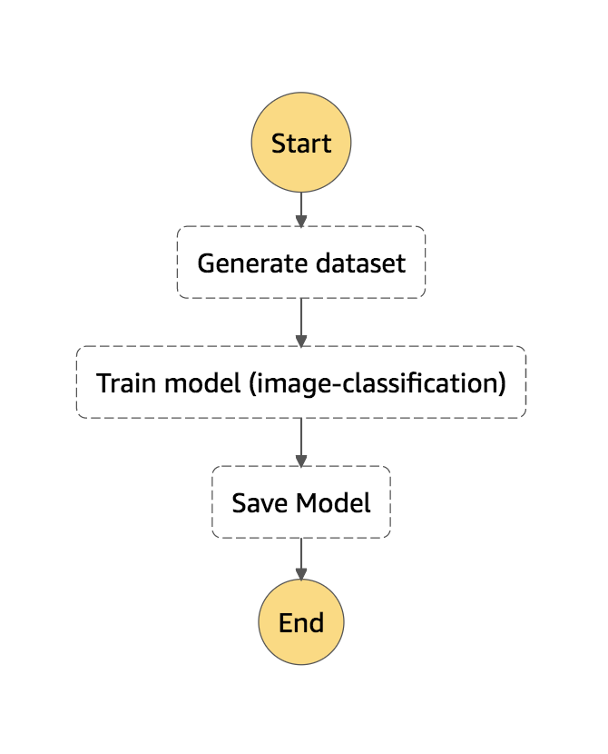
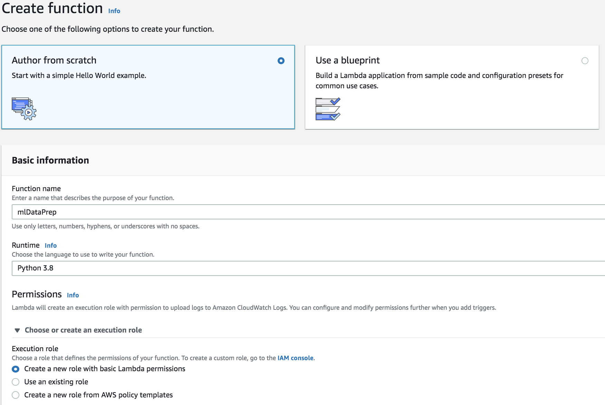
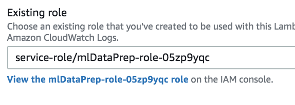
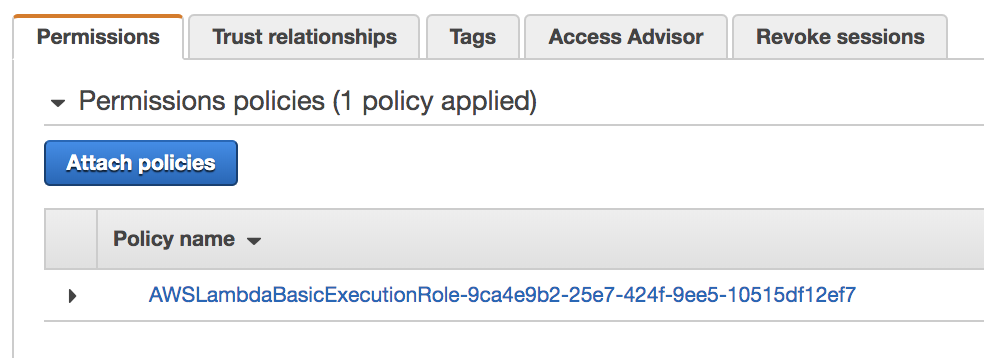
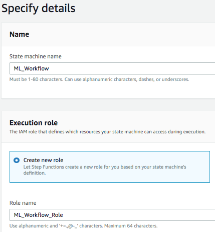

# ML Workflow

## The workflow problem

Once you have finished coding your ML code, it might be necessary to retrain the model from time to time, as new data becomes available. So, we will create an automated workflow for this task.

## SageMaker Workflows

Now we will create an ML Workflow to retrain the model.

SageMaker has integration with some orchestration tools such as AWS Step Functions and Apache Airflow.
In this workshop, we will use Step Functions to prepare, train, and deploy our machine learning model.

The workflow steps will look like the figure below:

- Generate Dataset: Invokes a lambda function responsible for reading the folder and file structure in S3 and generating a LST file containing some metadata.
- Train Model: Creates and runs a training job in SageMaker.
- Save Model: Saves the model for later use.

## Dataprep using Amazon Lambda

Before we can create our workflow, we need to create the Lambda function responsible for generating the metadata files.

**Step 1:** Go to the Lambda console and create a new function from scratch, as follows:

**Step 2:** Once you have created your function, click on it:

**Step 3:** Search for the role created for the lambda function, and click "View the mlDataPrep-role-xyz role"

**Step 4:** Click "Attach Policies", select the AmazonS3FullAccess policy, and click "Attach Policy".

**Step 5:** Now return to your Lambda function. Change the Timeout to 15 minutes:

**Step 6:** The last step to finalize our function is to modify the source code. Download the source code [here](code/generate_lst_lambda_template.py?raw=True) and paste it into the "Function Code" field.

**Step 7:** Now follow the instructions in the source code and modify the name of the buckets according to the list below. 

- N. Virginia (us-east-1): replace by "mammography-workshop"
- Ohio (us-east-2): replace by "mammography-workshop-ohio"
- Oregon (us-west-2): replace by "mammography-workshop-oregon"
- Ireland (eu-west-1): replace by "mammography-workshop-ireland"

Then save and test the function. Check the function output logs. If successful, you will see the following message:

## Workflow definition using AWS Step Functions

Now that you have your Lambda function ready, you can create your Workflow.

**Step 8:** Go to the step functions console and create a new State Machine by clicking on "State Machines" / "Create state machine".

**Step 9:** Download/Open the workflow definition file [here](code/model_workflow_template.json?raw=True) and paste the contents into the "Definition" field.

**Step 10:** Click the "refresh" button in the picture to see the graphical representation of your workflow. It should look like the following image:

**Step 11:** In the code you just copied inside the "Definition" field, replace the following information:

- "Resource": "<<arn_of_your_lambda>>"

    [Click here](https://console.aws.amazon.com/lambda/home?/functions/mlDataPrep#/functions/mlDataPrep?tab=configuration) to open the Configuration tab of your lambda function. On the top right corner, you will find the Lambda's function ARN.
- "TrainingImage": "<<training_image_URL>>"
    Replace the training image URL according to your region:
    - N. Virginia (us-east-1): replace by "811284229777.dkr.ecr.us-east-1.amazonaws.com/image-classification:latest"
    - Ohio (us-east-2): replace by "825641698319.dkr.ecr.us-east-2.amazonaws.com/image-classification:latest"
    - Oregon (us-west-2): replace by "433757028032.dkr.ecr.us-west-2.amazonaws.com/image-classification:latest"
    - Ireland (eu-west-1): replace by "685385470294.dkr.ecr.eu-west-1.amazonaws.com/image-classification:latest"
- "S3OutputPath": "s3://<<your_output_bucket>>/models"

    The name of the bucket created for the output files by the first CloudFormation of this lab.
- "RoleArn": "<<arn_of_your_sagemaker_execution_role>>"

    Navigate to your [notebook instances](https://console.aws.amazon.com/sagemaker/home#/notebook-instances)
    There, click on the instance created for this lab. In the **Permissions and encryption** field, you will see **IAM role ARN**. Copy that value and paste here. You will need this information below again. 
- "S3Uri": "s3://<<name_of_the_bucket_with_the_input_images>>/resize/train/"

    This should be, depending on your region:
        - N. Virginia (us-east-1): replace by "mammography-workshop"
        - Ohio (us-east-2): replace by "mammography-workshop-ohio"
        - Oregon (us-west-2): replace by "mammography-workshop-oregon"
        - Ireland (eu-west-1): replace by "mammography-workshop-ireland"
- "S3Uri": "s3://<<name_of_the_bucket_with_the_input_images>>/resize/test/"

    Same as above.
- "S3Uri": "s3://<<name_of_the_bucket_with_the_input_images>>/resize/train-data.lst"

    Same as above.
- "S3Uri": "s3://<<name_of_the_bucket_with_the_input_images>>/resize/test-data.lst"

    Same as above.
- "Image": "<<training_image_URL>>" 

    Replace the training image URL according to your region:
    - N. Virginia (us-east-1): replace by "811284229777.dkr.ecr.us-east-1.amazonaws.com/image-classification:latest"
    - Ohio (us-east-2): replace by "825641698319.dkr.ecr.us-east-2.amazonaws.com/image-classification:latest"
    - Oregon (us-west-2): replace by "433757028032.dkr.ecr.us-west-2.amazonaws.com/image-classification:latest"
    - Ireland (eu-west-1): replace by "685385470294.dkr.ecr.eu-west-1.amazonaws.com/image-classification:latest"
- "ExecutionRoleArn": "<<arn_of_your_sagemaker_execution_role>>"

    Paste here the same information of "RoleArn" above.
    
    
**Step 12:** Now click "Next", fill out the fields as the image below and click "Create state machine".

Congratulations! You have created your first Machine Learning Workflow. 

**Step 13:** To test it, click "Start execution". The workflow should take about 10 minutes to complete. If successful, at the end you will see the following image, with all the steps colored in green:

Let's go back to the lab by clicking [here](/../../#6---step-functions)