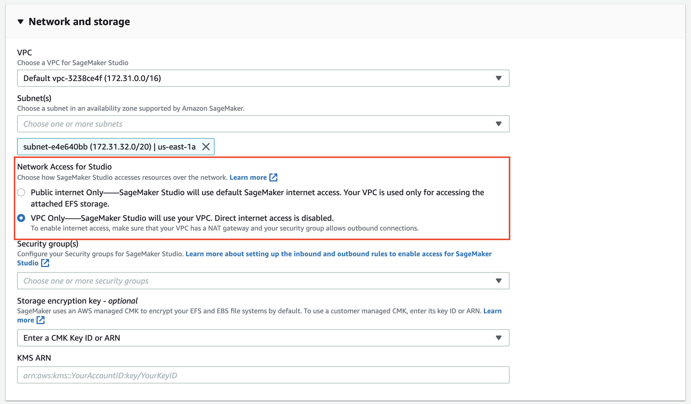
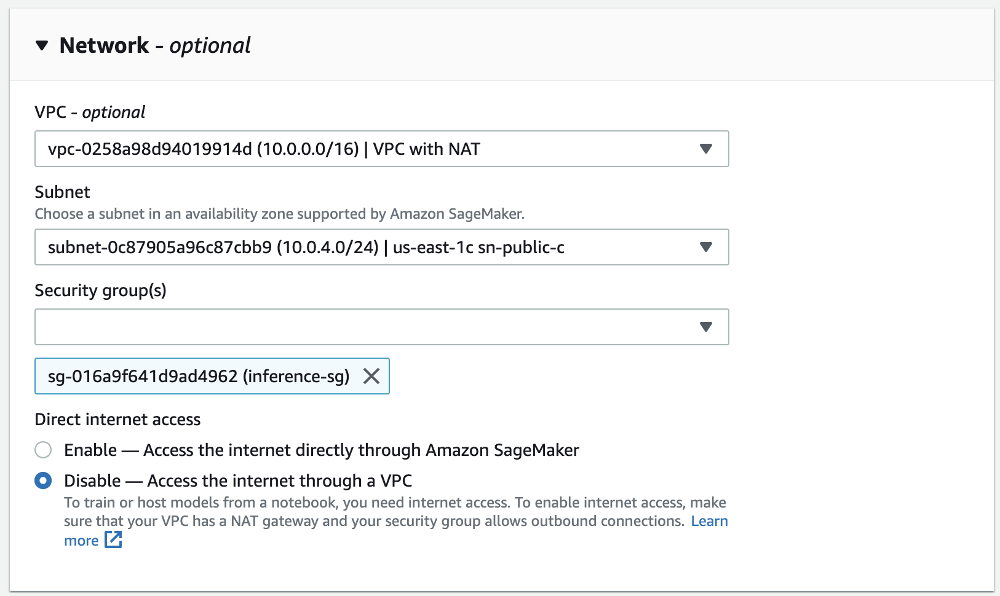
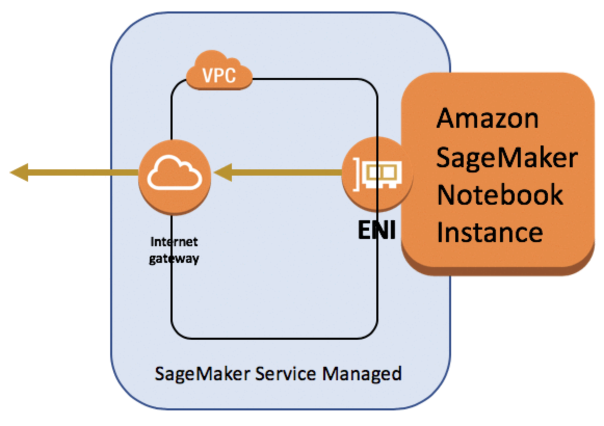
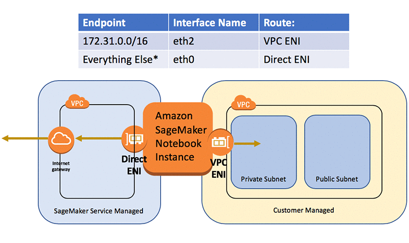
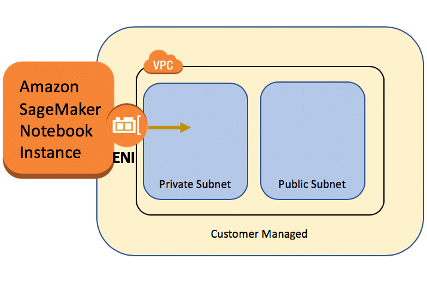
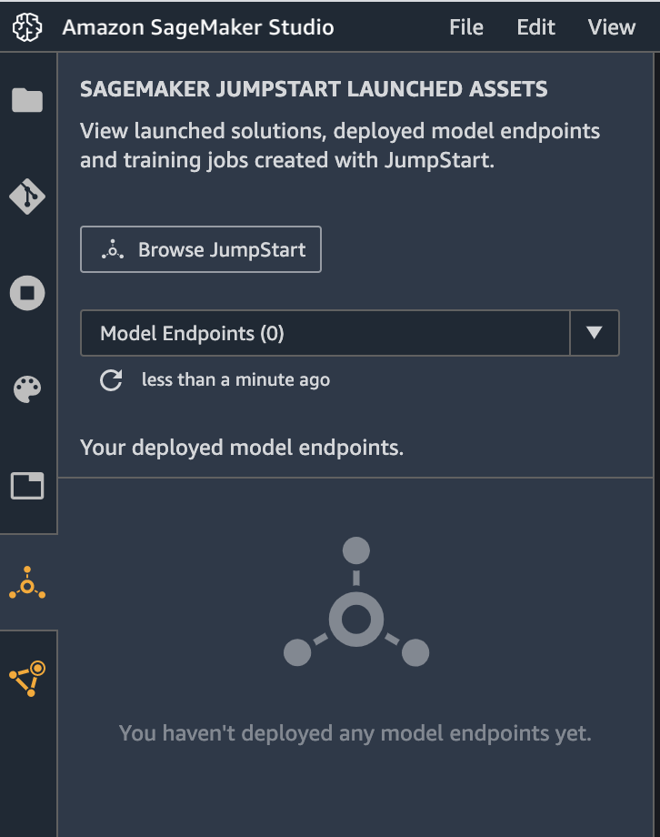

# Based on this blog post:  https://aws.amazon.com/blogs/machine-learning/securing-amazon-sagemaker-studio-internet-traffic-using-aws-network-firewall/

# Amazon SageMaker Studio in a private VPC with NAT Gateway and Network Firewall

This solution demonstrates the setup and deployment of Amazon SageMaker Studio into a private VPC and implementation of multi-layer security controls, such as data encryption, network traffic monitoring and restriction, usage of VPC endpoints, subnets and security groups, and IAM resource policies. This source code repository is for the [Securing Amazon SageMaker Studio internet traffic using AWS Network Firewall](https://aws.amazon.com/blogs/machine-learning/securing-amazon-sagemaker-studio-internet-traffic-using-aws-network-firewall/) post on the [AWS Machine Learning Blog](https://aws.amazon.com/blogs/machine-learning/).

The use case is a real-life environment security setup, which generally requires the following security-related features to be in place:
- End-to-end data encryption at rest and in transit
- Network traffic and activity monitoring and logging
- Internet traffic restriction and monitoring
- Control and restriction of Amazon S3 bucket access
- Application of standard AWS security controls (IAM users, roles and permission policies) to SageMaker workloads
- Application of standard AWS multi-layer network security controls (NACLs, Network Firewall, NAT Gateway, security groups) to isolate SageMaker workloads like notebook instances, training and processing jobs, and inference endpoints

All these specific requirements are covered in the solution.

[Jump to the deployment instructions](README.md#Deployment)

# SageMaker security
You can apply all the same security and compliance approaches and best practices (authentication, authorization, VPC, network isolation, control and monitoring) as a consistent set of Amazon security features to Amazon SageMaker workloads and Amazon SageMaker Studio specifically. 
 
## Network isolation
Common approaches for network isolation can also be applied to SageMaker workloads:
- you can enable [network isolation](https://docs.aws.amazon.com/vpc/index.html): Containers that run with network isolation cannot make any outbound network calls.
- you can use a [private VPC](https://docs.aws.amazon.com/vpc/latest/userguide/vpc-getting-started.html) with subnets, [NACLs](https://docs.aws.amazon.com/vpc/latest/userguide/vpc-network-acls.html) and [security groups](https://docs.aws.amazon.com/vpc/latest/userguide/VPC_SecurityGroups.html) for further locking down the containers
- you can use [VPC endpoints](https://docs.aws.amazon.com/vpc/latest/userguide/vpc-endpoints.html) and [VPC PrivateLink](https://docs.aws.amazon.com/vpc/latest/userguide/endpoint-service.html) to control access to resources for your SageMaker notebooks, containers and resources
- you can enable inter-container traffic encryption

For example, you can enable network isolation controls when you create a SageMaker processing job:


## Access to resources in VPC
To avoid making your data and model containers accessible over the internet, we recommend that you create a **private VPC** and configure it to control access to your AWS resources. Using a VPC helps to protect your training containers and data because you can configure your VPC so that it is not connected to the internet and represents a completely isolated network environment. Using a VPC also allows you to monitor all network traffic in and out of your ML containers by using [VPC flow logs](https://docs.aws.amazon.com/vpc/latest/userguide/flow-logs.html).

You specify your private VPC configuration when you create a SageMaker workload (a notebook instance, processing or training job, model) by selecting a VPC and specifying subnets and security groups. When you specify the subnets and security groups, SageMaker creates _elastic network interfaces_ (ENI) that are associated with your security groups in one of the subnets. Network interfaces allow your model containers to connect to resources in your VPC.

Please refer to more details on specific deployment use cases to [10].

After you configure the SageMaker workloads or SageMaker Studio to be hosted in your private VPC, you can apply all common VPC-based security controls (subnets, NACLs, security groups, VPC endpoints, NAT Gateway, and Network Firewall).

## Deploy SageMaker Studio to VPC
You can choose to restrict which traffic can access the internet by [launching Studio in a Virtual Private Cloud (VPC)](https://docs.aws.amazon.com/sagemaker/latest/dg/onboard-vpc.html) of your choosing. This allows you fine-grained control of the network access and internet connectivity of your SageMaker Studio notebooks. You can disable direct internet access to add an additional layer of security. You can use AWS Network Firewall to implement further controls (stateless or stateful traffic filtering and applying your custom network firewall policies) on SageMaker workloads.

The following network settings are available when you create a new SageMaker Studio domain:



Amazon SageMaker Studio runs on an environment managed by AWS. When launching a new Studio domain, the parameter `AppNetworkAccessType` defines the external connectivity for such domain.

Direct internet access with `AppNetworkAccessType=DirectInternetOnly`:


No direct internet access with `AppNetworkAccessType=VpcOnly`:


❗ You won't be able to run a Studio notebook in `VpcOnly` mode unless your VPC has an interface endpoint to the SageMaker API and runtime, or a NAT gateway, and your security groups allow outbound connections.

## Data encryption at rest and transit
Models and data are stored on the SageMaker Studio home directories in EFS or on SageMaker notebook EBS volumes. You can apply the [standard practices and patterns](https://docs.aws.amazon.com/sagemaker/latest/dg/encryption-at-rest.html) to encrypt data using AWS KMS keys. This solution creates an AWS KMS CMK for EBS volume encryption that you can use to encrypt notebook instance data.

All communication with VPC endpoints to the public AWS services (SageMaker API, SageMaker Notebooks etc) are restricted to HTTPS protocol. You can control the set of network protocols for any communication between your protected workload subnet with help of VPC security groups or NACLs.

See the [Amazon SageMaker developer guide](https://docs.aws.amazon.com/sagemaker/latest/dg/encryption-in-transit.html) for more information on protecting data in transit.

## Amazon S3 access control
Developing ML models requires access to sensitive data stored on specific S3 buckets. You might want to implement controls to guarantee that:

- Only specific Studio domains or SageMaker workloads and users can access these buckets
- Each Studio domain or SageMaker workload have access to the defined S3 buckets only

We implement this requirement by using an S3 VPC Endpoint in your private VPC and configuring VPC Endpoint and S3 bucket policies.

First, start with the S3 bucket policy attached to the **specific S3 bucket**:
```json
{
    "Version": "2008-10-17",
    "Statement": [
        {
            "Effect": "Deny",
            "Principal": "*",
            "Action": [
                "s3:GetObject",
                "s3:PutObject",
                "s3:ListBucket"
            ],
            "Resource": [
                "arn:aws:s3:::<s3-bucket-name>/*",
                "arn:aws:s3:::<s3-bucket-name>"
            ],
            "Condition": {
                "StringNotEquals": {
                    "aws:sourceVpce": "<s3-vpc-endpoint-id>"
                }
            }
        }
    ]
}
```
The bucket policy explicitly denies all access to the bucket which does not come from the **designated VPC endpoint**.

Second, attach the following permission policy to the **S3 VPC Endpoint**:
```json
{
    "Version": "2012-10-17",
    "Statement": [
        {
            "Effect": "Allow",
            "Principal": "*",
            "Action": [
                "s3:GetObject",
                "s3:PutObject",
                "s3:ListBucket"
            ],
            "Resource": [
                "arn:aws:s3:::<s3-bucket-name>",
                "arn:aws:s3:::<s3-bucket-name>/*"
            ]
        }
    ]
}
```
This policy allows access the designated S3 buckets only.

This combination of S3 bucket policy and VPC endpoint policy, together with Amazon SageMaker Studio VPC connectivity, establishes that SageMaker Studio can only access the referenced S3 bucket, and this S3 bucket can only be accessed from the VPC endpoint.

❗ You will not be able to access these S3 buckets from the AWS console or `aws cli`.

All network traffic between Amazon SageMaker Studio and S3 is routed via the designated S3 VPC Endpoint over AWS private network and never traverses public internet.

You may consider to enable access to other S3 buckets via S3 VPC endpoint policy, for example to shared public SageMaker buckets, to enable additional functionality in the Amazon SageMaker Studio, like [JumpStart](https://docs.aws.amazon.com/sagemaker/latest/dg/studio-jumpstart.html).
If you want to have access ot JumpStart, you must add the following statement to the S3 VPC endpoint policy:
```json
    {
      "Effect": "Allow",
      "Principal": "*",
      "Action": [
        "s3:GetObject"
      ],
      "Resource": "*",
      "Condition": {
        "StringEqualsIgnoreCase": {
          "s3:ExistingObjectTag/SageMaker": "true"
        }
      }
    }
```

## Secure configuration of SageMaker notebook instances
Amazon SageMaker notebook instances can be launched with or without your Virtual Private Cloud (VPC) attached. When launched with your VPC attached, the notebook can either be configured with or without direct internet access:



You have three options for network configuration:
- Without VPC
- With VPC with direct internet access
- With VPC without direct internet access

Direct internet access means that the Amazon SageMaker service is providing a network interface that allows for the notebook to talk to the internet through a VPC managed by the service.

For more information, see [11].

### Without VPC
All the traffic goes through the Elastic Network Interface (ENI) attached to the managed EC2 instance, which is running in Amazon SageMaker managed VPC.



All traffic goes via the ENI within an Amazon SageMaker managed VPC.

### Private attached VPC with direct internet access
2 ENI attached to the managed EC2 instance:



### Private attached VPC without direct internet access
1 ENI attached to the managed EC2 instance.
For internet access the traffic should be routed via a NAT gateway or a virtual private gateway:



Please consult [11] for more information on ENI configuration and routing options.

## Limit internet ingress and egress
When you configure the SageMaker Studio or SageMaker workload to use your private VPC without direct internet access option, the routing of internet inbound and outbound traffic is fully controlled by your VPC networking setup.

If you want to provide internet access through your VPC, just add an internet gateway or NAT gateway (if you want to block the inbound connections) and the proper routing entries. The internet traffic flows through your VPC, and you can implement other security controls such as inline inspections with a firewall or internet proxy. 

You can use the [AWS Network Firewall](https://aws.amazon.com/network-firewall/) to implement URL, IP address, and domain-based stateful and stateless inbound and outbound traffic filtering.

This solution demonstrates the usage of the AWS Network Firewalls for domain names stateful filtering as a sample use case.

## Enforce secure deployment of SageMaker resources
Three approaches for deploying Amazon SageMaker resources securely:

- Preventive controls:
  - IAM Condition keys approach
  - AWS Service Catalog approach

- Responsive controls:
 - CloudWatch Events approach

 For more information, see [5].

### IAM condition keys approach
IAM condition keys can be used to improve security by preventing resources from being created without security controls.  

```json
"Condition": {
   "StringEquals": {
      "sagemaker:RootAccess": "Disabled"
   }
}
```

[Amazon SageMaker service-specific condition keys](https://docs.aws.amazon.com/IAM/latest/UserGuide/list_amazonsagemaker.html)

Security-specific examples of the condition keys:
- `sagemaker:DirectInternetAccess`
- `sagemaker:InterContainerTrafficEncryption`
- `sagemaker:NetworkIsolation`
- `sagemaker:RootAccess`
- `sagemaker:VPCSecurityGroupIds`: should be set to a pre-created security group configured with the necessary controls
- `sagemaker:VPCSubnets`
- `sagemaker:VolumeKmsKey`
- `sagemaker:OutputKmsKey`

### Example: Enforce usage of network isolation mode
To enforce usage of resource secure configuration, you can add the following policy to the SageMaker execution role:
```json
{
    "Version": "2012-10-17",
    "Statement": [
        {
            "Effect": "Deny",
            "Action": [
                "sagemaker:Create*"
            ],
            "Resource": "*",
            "Condition": {
                "StringNotEqualsIfExists": {
                    "sagemaker:NetworkIsolation": "true"
                }
            }
        }
    ]
}
```

The policy denies creation of any component (processing or traning job, endpoint, transform job) if the `sagemaker:NetworkIsolation` parameter is not set to `true`. This applies only to the components which have this parameter.
Similarly you can add validation of any other SageMaker service-specific condition keys.

### AWS Service Catalog approach
Based on pre-defined CloudFormation templates to provision requested resources.

The following Amazon SageMaker resource types are supported by AWS CloudFormation. All other Amazon SageMaker resources need to be created using the custom resource approach.

- `AWS::SageMaker::CodeRepository` creates a Git repository that can be used for source control.
- `AWS::SageMaker::Endpoint` creates an endpoint for inferencing.
- `AWS::SageMaker::EndpointConfig` creates a configuration for endpoints for inferencing.
- `AWS::SageMaker::Model` creates a model for inferencing.
- `AWS::SageMaker::NotebookInstance` creates a notebook instance for development.
- `AWS::SageMaker::NotebookInstanceLifecycleConfig` creates shell scripts that run when notebook instances are created and/or started.
- `AWS::SageMaker::Workteam `creates a work team for labeling data.

### CloudWatch Events approach
Amazon CloudWatch and CloudWatch Events can be used to implement responsive controls to improve security.
You can monitor events from SageMaker service via CloudWatch Events rule and trigger a Lambda function to inspect if a SageMaker resource implements all of the necessary security controls

# Demo setup overview
The solution implements the following setup to demonstrate the usage of SageMaker Studio deployment into a private VPC, usage of NAT Gateway and Network Firewall for internet traffic control.


❗ The solution uses **only one availability zone (AZ)** and is not highly-available. We do not recommend to use the single-AZ setup for any production deployment. The HA solution can be implemented by duplicating the single-AZ setup (subnets, NAT Gateway, Network Firewall endpoints) to additional AZs.  
❗ The CloudFormation template will setup the Network Firewall routes automatically. However, the current implementation works only with single-AZ deployment:
```yaml
VpcEndpointId: !Select ["1", !Split [":", !Select ["0", !GetAtt NetworkFirewall.EndpointIds]]]
```
For multi-AZ setup you need to implement a CloudFormation custom resource (e.g. Lambda function) to setup the Network Firewall endpoints in each subnet properly.

## VPC resources
The solution deploys the following resources:
- VPC with a specified CIDR
- Three private subnets with specified CIDRs: 
    - SageMaker subnet
    - NAT Gateway subnet
    - Network Firewall subnet
- Internet Gateway, NAT Gateway, Network Firewall, and Firewall endpoint in the Network Firewall subnet
- Network Firewall Policy
- Stateful rule group with an allow domain list with a single domain on the list
- Elastic IP allocated to the NAT Gateway
- Security Groups:
    - SageMaker security group
    - VPC endpoints security group
- Configured security group inbound rules
- Four route tables for network routing and configured routes
- S3 VPC endpoint (type `Gateway`)
- AWS service-access VPC endpoints (type `Interface`) for various AWS services

## S3 resources
The solution deploys two Amazon S3 buckets: 
- `<project_name>-<region>-data`  
- `<project_name>-<region>-models`

Both buckets have a bucket policy attached. The bucket policy explicitly denies all access to the bucket which does not come from the designated VPC endpoint.
The Amazon S3 VPC endpoint has also a policy attached to it. This policy allows access the the two S3 buckets (`model` and `data`) only.

As discussed above, this combination of S3 bucket policy and VPC endpoint policy ensures that SageMaker Studio can only access the referenced S3 buckets, and these S3 buckets can only be accessed from the VPC endpoint.

## IAM resources
Two AWS KMS customer keys are deployed by the solution:
- a KMS key for S3 bucket encryption
- a KMS key for SageMaker notebooks' EBS encryption
- a SageMaker IAM execution role

The solution also creates and deploys an IAM execution role for SageMaker notebooks and SageMaker Studio with pre-configured IAM policies.

## SageMaker resources
The solution creates:
- SageMaker Domain
- SageMaker User Profile

# Deployment

## Prerequisites
- An AWS Account
- An IAM user or role with administrative access
- configured `aws cli` with that IAM user, role credentials, or temporary credentials
- An Amazon S3 bucket in your account in the same region where you deploy the solution (or you can create one as described below)
- Your deployment region is `us-east-1`, `us-east-2`, `us-west-2`, `eu-west-1`, `eu-central-1`, `eu-north-1`, `ap-southeast-2`, or `ap-northeast-1`. AWS Network Firewall is [available](https://aws.amazon.com/network-firewall/faqs/) in the US East (N. Virginia, Ohio), US West (Oregon), Europe (Ireland, Frankfurt, Stockholm), and Asia Pacific (Sydney, Tokyo) regions
  
❗ For CloudFormation template deployment you must use the S3 bucket in the **same region** as your deployment region.
If you need to deploy the solution in multiple regions, you need to create a bucket per region and specify the corresponding bucket name in the `make deploy` call as shown below.
  
❗ The solution will successfully deploy AWS Network Firewall only in the regions where the Network Firewall is available. In all other regions you will get a CloudFormation validation exception.
  
❗ If you have already one SageMaker domains in the current region deployed, the deployment will fail because there is limit of one SageMaker domain per region per AWS account.

## CloudFormation stack parameters
There are no required parameters. All parameters have default values. You may want to change the `DomainName` or `*CIDR` parameters to avoid naming conflict with the existing resources and CIDR allocations.

- `ProjectName`: **OPTONAL**. Default is `sagemaker-studio-anfw`
- `DomainName`: **OPTIONAL**: SageMaker domain name. Default is `sagemaker-anfw-domain-<region>`  
- `UserProfileName`: **OPTIONAL**: User profile name for the SageMaker domain. Default is `anfw-user-profile-<region>`
- `VPCCIDR`: **OPTONAL**. Default is 10.2.0.0/16
- `FirewallSubnetCIDR`: **OPTONAL**. Default is 10.2.1.0/24
- `NATGatewaySubnetCIDR`: **OPTONAL**. Default is 10.2.2.0/24
- `SageMakerStudioSubnetCIDR`: **OPTONAL**. Default is 10.2.3.0/24

You can change the stack parameters in the `Makefile` or pass them as variable assignments as part of `make` call.

❗ Please make sure that default or your custom CIDRs do not conflict with any existing VPC in the account and the region where you are deploying the CloudFormation stack.

## Deployment steps

To deploy the stack into the **current account and region** please complete the following steps.

### Clone the GitHub repository
```bash
git clone https://github.com/aws-samples/amazon-sagemaker-studio-vpc-networkfirewall.git
cd amazon-sagemaker-studio-vpc-networkfirewall
```

### Create a S3 bucket
You need a S3 bucket for CloudFormation deployment. If you don't have a S3 bucket in the **current region**, you can create one via the `aws cli`:
```bash
aws s3 mb s3://<your s3 bucket name>
```

### Deploy CloudFormation stack
```bash
make deploy CFN_ARTEFACT_S3_BUCKET=<your s3 bucket name>
```

You can specify non-default values for stack parameters in the `make deploy` command. See [`Makefile`](Makefile) for parameter names.

The bucket **must** be in the same region where you are deploying. You specify just the bucket name, not a S3 URL or a bucket ARN.

The stack will deploy all needed resources like VPC, network devices, route tables, security groups, S3 buckets, IAM policies and roles, VPC endpoints and also create a new SageMaker studio domain, and a new user profile.

The deployment takes about 25 minutes to complete. After deployment completes, you can see the full list of stack output values by running the following command in a terminal:
```bash
aws cloudformation describe-stacks \
    --stack-name sagemaker-studio-demo \
    --output table \
    --query "Stacks[0].Outputs[*].[OutputKey, OutputValue]"
```

You can now launch the Amazon SageMaker Studio from the SageMaker console or generate a pre-signed URL and launch the Studio from the browser:
```bash
DOMAIN_ID=# SageMakerStudioDomainId from the stack output
USER_PROFILE_NAME=# UserProfileName from the stack output

aws sagemaker create-presigned-domain-url \
    --domain-id $DOMAIN_ID \
    --user-profile-name $USER_PROFILE_NAME
```

# Demo
Start the Amazon SageMaker Studio from the pre-signed URL or via the AWS SageMaker console.

## Infrastructure walk-through
Take a look to the following components and services created by the deployment:
- VPC setup
- Subnets
- Network devices (NAT Gateway, Network Firewall) and the route tables
- Deployed security groups (SageMaker and VPC Endpoints security groups) and their ingress and egress rules
- S3 VPC endpoint setup with the endpoint policy 
- S3 VPC interface endpoints for AWS public services
- S3 buckets (named `<project_name>-<region>-models` and `<project_name>-<region>-data`) with the bucket policy. You can try and see that there is no AWS console access to the solution buckets (`data` and `models`). When you try to list the bucket content in AWS console you will get `AccessDenied` exception
- Network Firewall routing setup. You might want to read through [8] to familiarize yourself with different types of AWS Network Firewall deployment
- Firewall policy with a stateful rule group with an allow domain list. There is a single domain `.kaggle.com` on the list
- SageMaker IAM execution role
- KMS CMKs for EBS and S3 bucket encryption

## S3 access 
- open a notebook in SageMaker Studio.
- create a file 
```
!touch test-file.txt
```
- copy file to `data` S3 bucket
```
!aws s3 cp test-file.txt s3://<project_name>-<region>-data
```
- the operation must be successful

- try to copy the file to any other bucket or list any other bucket: AccessDenied error
```
!aws s3 ls s3://<any other bucket in your account>
```
- try to list the `<project_name>-<region>-data` bucket from a command line (in a terminal, not in the notebook instance): AccessDenied error

SageMaker Studio has access to only the designated buckets (`models` and `data`). You will not be able to use [SageMaker JumpStart](https://docs.aws.amazon.com/sagemaker/latest/dg/studio-jumpstart.html) or any other SageMaker Studio functionality which requires access to other Amazon S3 buckets. To enable access to other S3 buckets you have to change the S3 VPC endpoint policy.

Now we are going to change the S3 VPC endpoint policy and to allow access to additional S3 resources.
- First, try to open SageMaker Studio JumpStart:


The access is denied because the S3 VPC endpoint policy doesn't allow access to any S3 buckets except for `models` and `data` as configured in the endpoint policy:


Now add the following statement to the S3 VPC endpoint policy:
```json
    {
      "Effect": "Allow",
      "Principal": "*",
      "Action": [
        "s3:GetObject"
      ],
      "Resource": "*",
      "Condition": {
        "StringEqualsIgnoreCase": {
          "s3:ExistingObjectTag/SageMaker": "true"
        }
      }
    }
```

Command line:
```bash
cat <<EoF >s3-vpce-policy.json
{
    "Effect": "Allow",
    "Principal": "*",
    "Action": [
    "s3:GetObject"
    ],
    "Resource": "*",
    "Condition": {
    "StringEqualsIgnoreCase": {
        "s3:ExistingObjectTag/SageMaker": "true"
    }
    }
}
EoF
```

```bash
VPCE_ID=# VPC Id from the stack output

aws ec2 modify-vpc-endpoint \
    --vpc-endpoint-id $VPCE_ID \
    --policy-document file://s3-vpce-policy.json
```

- Refresh the JumpPage start page - now you have access to all JumpStart resources

We have seen now, that you can control access to S3 buckets via combination of S3 bucket policy and S3 Endpoint policy.

## Controlling internet access
This [blog post](link) shows how the internet ingress and egress for SageMaker Studio can be controlled with AWS Network Firewall.

# Clean up
This operation will delete the whole stack together with SageMaker Studio Domain and user profile.

1. Exit all instances SageMaker Studio.
2. Check if KernelGateway is running (in the SageMaker Studio control panel in AWS Console). If yes, delete KernelGateway and wait until the deletion process finishes
3. If you enabled logging configuration for Network Firewall, remove it from the Firewall Details (AWS Console)
4. If you changed the stateful rule group in the firewall policy, delete all added domain names leaving only the original name (`.kaggle.com`)
5. Delete the stack:
```bash
make delete
```

Alternatively you can delete the stack from the AWS CloudFormation console.

## Delete left-over resources
The deployment of Amazon SageMaker Studio creates a new EFS file system in your account. When you delete the data science environment stack, the SageMaker Studio domain, user profile and Apps are also deleted. However, the EFS file system **will not be deleted** and kept "as is" in your account (EFS file system contains home directories for SageMaker Studio users and may contain your data). Additional resources are created by SageMaker Studio and retained upon deletion together with the EFS file system:
- EFS mounting points in each private subnet of your VPC
- ENI for each mounting point
- Security groups for EFS inbound and outbound traffic

❗ To delete the EFS file system and EFS-related resources in your AWS account created by the deployment of this solution, do the following steps **after** after deletion of CloudFormation stack.

❗ **This is a destructive action. All data on the EFS file system will be deleted (SageMaker home directories). You may want to backup the EFS file system before deletion**

From AWS console:  
- Delete the SageMaker EFS system (from the EFS AWS console). You may want to backup the EFS file system before deletion
- Go to the VPC console and delete the SageMaker Studio VPC

## Stack deletion troubleshooting
Sometimes stack might fail to delete. If stack deletion fails, check the events in the AWS CloudFormation console.

If the deletion of the SageMaker domain fails, check if there are any running applications (e.g. KernelGateway) for the user profile as described in [Delete Amazon SageMaker Studio Domain](https://docs.aws.amazon.com/sagemaker/latest/dg/gs-studio-delete-domain.html). Try to delete the applications and re-run the `make delete` command or delete the stack from AWS CloudFormation console.

If the deletion of the Network Firewall fails, check is you removed the logging configuration and the stateful rule group is in the original state.

# Resources
[1]. [SageMaker Security in the Developer Guide](https://docs.aws.amazon.com/sagemaker/latest/dg/security.html)  
[2]. [SageMaker Infrastructure Security](https://docs.aws.amazon.com/sagemaker/latest/dg/infrastructure-security.html)  
[3]. Initial version of the CloudFormation templates for deployment of VPC, Subnets, and S3 buckets is taken from this [GitHub repository](https://github.com/aws-samples/amazon-sagemaker-studio-vpc-blog)  
[4]. Blog post for the repository: [Securing Amazon SageMaker Studio connectivity using a private VPC](https://aws.amazon.com/blogs/machine-learning/securing-amazon-sagemaker-studio-connectivity-using-a-private-vpc/)  
[5]. [Secure deployment of Amazon SageMaker resources](https://aws.amazon.com/blogs/security/secure-deployment-of-amazon-sagemaker-resources/)  
[6]. Security-focused workshop [Amazon SageMaker Workshop: Building Secure Environments](https://sagemaker-workshop.com/security_for_sysops.html)  
[7]. [Amazon SageMaker Identity-Based Policy Examples](https://docs.aws.amazon.com/sagemaker/latest/dg/security_iam_id-based-policy-examples.html)  
[8]. [Deployment models for AWS Network Firewall](https://aws.amazon.com/blogs/networking-and-content-delivery/deployment-models-for-aws-network-firewall/)  
[9]. [VPC Ingress Routing – Simplifying Integration of Third-Party Appliances](https://aws.amazon.com/blogs/aws/new-vpc-ingress-routing-simplifying-integration-of-third-party-appliances/)  
[10]. [Host SageMaker workloads in a private VPC](https://docs.aws.amazon.com/sagemaker/latest/dg/host-vpc.html)  
[11]. [Understanding Amazon SageMaker notebook instance networking configurations and advanced routing options](https://aws.amazon.com/blogs/machine-learning/understanding-amazon-sagemaker-notebook-instance-networking-configurations-and-advanced-routing-options/)  
[12]. [Create Amazon SageMaker Studio using AWS CloudFormation](https://aws.amazon.com/blogs/machine-learning/creating-amazon-sagemaker-studio-domains-and-user-profiles-using-aws-cloudformation/)  
[13]. [Building secure machine learning environments with Amazon SageMaker](https://aws.amazon.com/blogs/machine-learning/building-secure-machine-learning-environments-with-amazon-sagemaker/)  
[14]. [Secure Data Science Reference Architecture GitHub](https://github.com/aws-samples/secure-data-science-reference-architecture)  


# Appendix

## aws cli commands to setup and launch Amazon SageMaker Studio
The following commands show how you can create Studio Domain and user profile from a command line. This is for reference only, as the stack creates the domain and user profile automatically.

### Create an Amazon SageMaker Studio domain inside a VPC
Please replace the variables with corresponding values from `sagemaker-studio-vpc` CloudFormation stack output:
```bash
REGION=$AWS_DEFAULT_REGION
SM_DOMAIN_NAME=# SageMaker domain name
VPC_ID=
SAGEMAKER_STUDIO_SUBNET_IDS=
SAGEMAKER_SECURITY_GROUP=
EXECUTION_ROLE_ARN=

aws sagemaker create-domain \
    --region $REGION \
    --domain-name $SM_DOMAIN_NAME \
    --vpc-id $VPC_ID \
    --subnet-ids $SAGEMAKER_STUDIO_SUBNET_IDS \
    --app-network-access-type VpcOnly \
    --auth-mode IAM \
    --default-user-settings "ExecutionRole=${EXECUTION_ROLE_ARN},SecurityGroups=${SAGEMAKER_SECURITY_GROUP}"
```
Note the `domain id` from the `DomainArm` returned by the `create-domain` call:

"DomainArn": "arn:aws:sagemaker:eu-west-1:ACCOUNT_ID:domain/**d-ktlfey9wdfub**"

### Create a user profile
```bash
DOMAIN_ID=
USER_PROFILE_NAME=

aws sagemaker create-user-profile \
    --region $REGION \
    --domain-id $DOMAIN_ID \
    --user-profile-name $USER_PROFILE_NAME
```

### Create pre-signed URL to access Amazon SageMaker Studio
```bash
aws sagemaker create-presigned-domain-url \
    --region $REGION \
    --domain-id $DOMAIN_ID \
    --user-profile-name $USER_PROFILE_NAME
```

Use the generated pre-signed URL to connect to Amazon SageMaker Studio

# License
This project is licensed under the MIT-0 License. See the [LICENSE](LICENSE) file.
