# Data Science on AWS - O'Reilly Book

[](https://studiolab.sagemaker.aws/import/github/data-science-on-aws/oreilly_book/blob/master/00_quickstart/00_Overview.ipynb)

## Get the book on [Amazon.com](https://www.amazon.com/Data-Science-AWS-End-End/dp/1492079391)

[](https://www.amazon.com/Data-Science-AWS-End-End/dp/1492079391/)

## Book Outline


# Quick Start Workshop (4-hours)
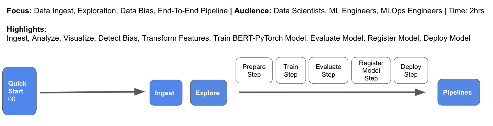

In this quick start hands-on workshop, you will build an end-to-end AI/ML pipeline for natural language processing with Amazon SageMaker.  You will train and tune a text classifier to predict the star rating (1 is bad, 5 is good) for product reviews using the state-of-the-art [BERT](https://arxiv.org/abs/1810.04805) model for language representation.  To build our BERT-based NLP text classifier, you will use a product reviews dataset where each record contains some review text and a star rating (1-5).

## Quick Start Workshop Learning Objectives
Attendees will learn how to do the following:
* Ingest data into S3 using Amazon Athena and the Parquet data format
* Visualize data with pandas, matplotlib on SageMaker notebooks
* Detect statistical data bias with SageMaker Clarify
* Perform feature engineering on a raw dataset using Scikit-Learn and SageMaker Processing Jobs
* Store and share features using SageMaker Feature Store
* Train and evaluate a custom BERT model using TensorFlow, Keras, and SageMaker Training Jobs
* Evaluate the model using SageMaker Processing Jobs
* Track model artifacts using Amazon SageMaker ML Lineage Tracking
* Run model bias and explainability analysis with SageMaker Clarify
* Register and version models using SageMaker Model Registry
* Deploy a model to a REST endpoint using SageMaker Hosting and SageMaker Endpoints
* Automate ML workflow steps by building end-to-end model pipelines using SageMaker Pipelines

# Extended Workshop (8-hours)
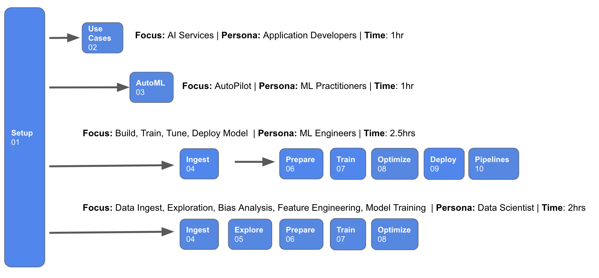

In the extended hands-on workshop, you will get hands-on with advanced model training and deployment techniques such as hyper-parameter tuning, A/B testing, and auto-scaling.  You will also setup a real-time, streaming analytics and data science pipeline to perform window-based aggregations and anomaly detection.

## Extended Workshop Learning Objectives
Attendees will learn how to do the following:
* Perform automated machine learning (AutoML) to find the best model from just your dataset with low-code
* Find the best hyper-parameters for your custom model using SageMaker Hyper-parameter Tuning Jobs
* Deploy multiple model variants into a live, production A/B test to compare online performance, live-shift prediction traffic, and autoscale the winning variant using SageMaker Hosting and SageMaker Endpoints
* Setup a streaming analytics and continuous machine learning application using Amazon Kinesis and SageMaker

# Workshop Instructions

[](https://studiolab.sagemaker.aws/import/github/data-science-on-aws/oreilly_book/blob/master/00_quickstart/00_Overview.ipynb)


[Amazon SageMaker Studio Lab](https://studiolab.sagemaker.aws/) is a free service that enables anyone to learn and experiment with ML without needing an AWS account, credit card, or cloud configuration knowledge.

## 1. Request Amazon SageMaker Studio Lab Account

Go to [Amazon SageMaker Studio Lab](https://studiolab.sagemaker.aws/), and request a free acount by providing a valid email address. 

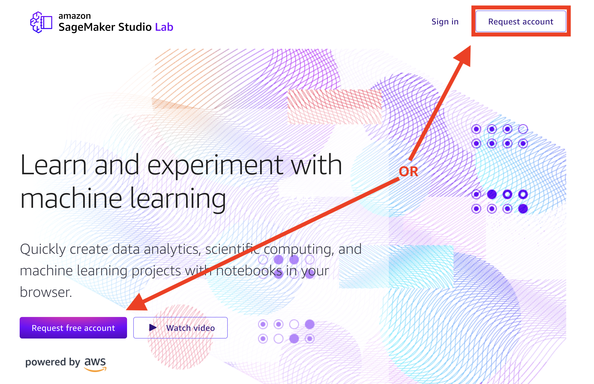
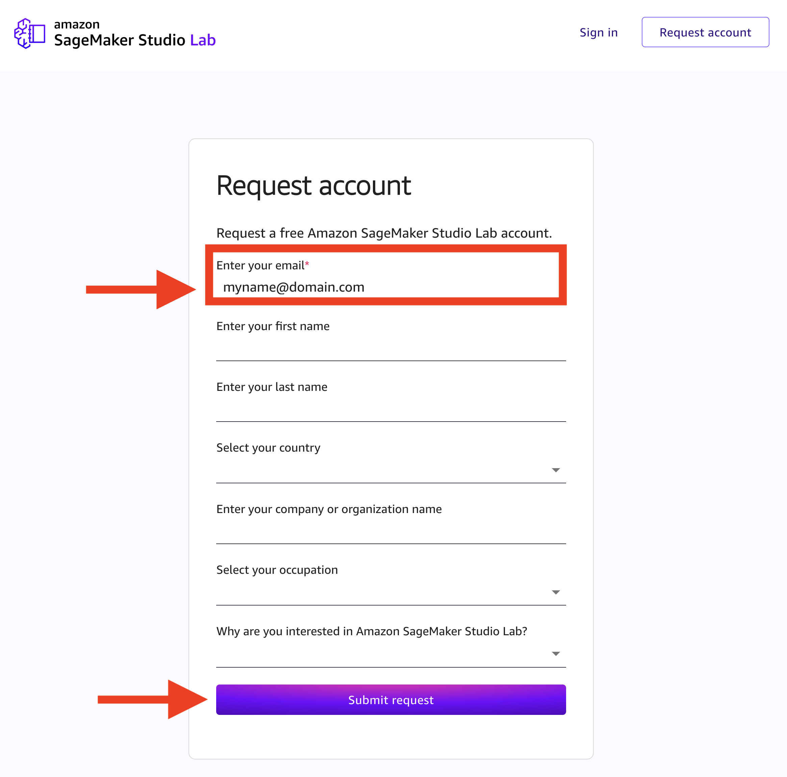

Note that Amazon SageMaker Studio Lab is currently in public preview. The number of new account registrations will be limited to ensure a high quality of experience for all customers.

## 2. Create Studio Lab Account

When your account request is approved, you will receive an email with a link to the Studio Lab account registration page. 

You can now create your account with your approved email address and set a password and your username. This account is separate from an AWS account and doesn't require you to provide any billing information.

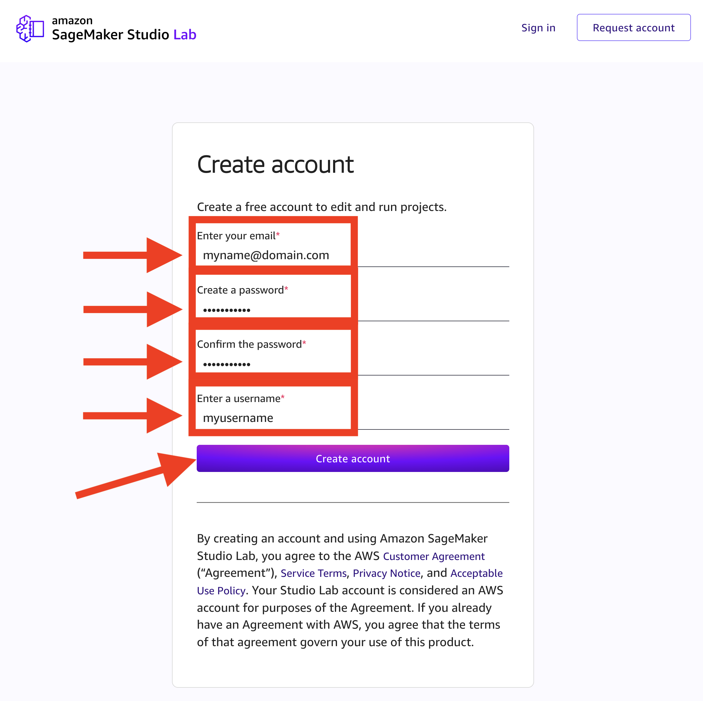

## 3. Sign in to your Studio Lab Account

You are now ready to sign in to your account. 

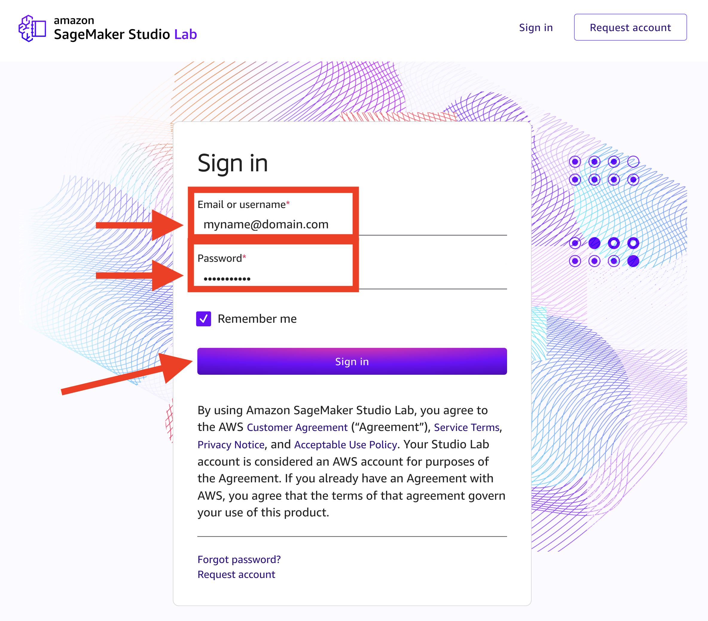

## 4. Select your Compute instance, Start runtime, and Open project


### CPU Option
Select CPU as the compute type and click `Start runtime`.

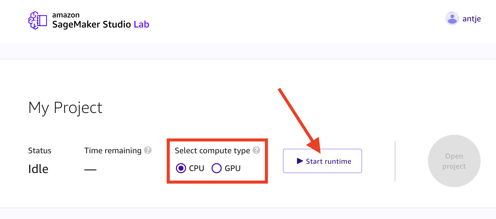

Once the Status shows `Running`, click `Open project`

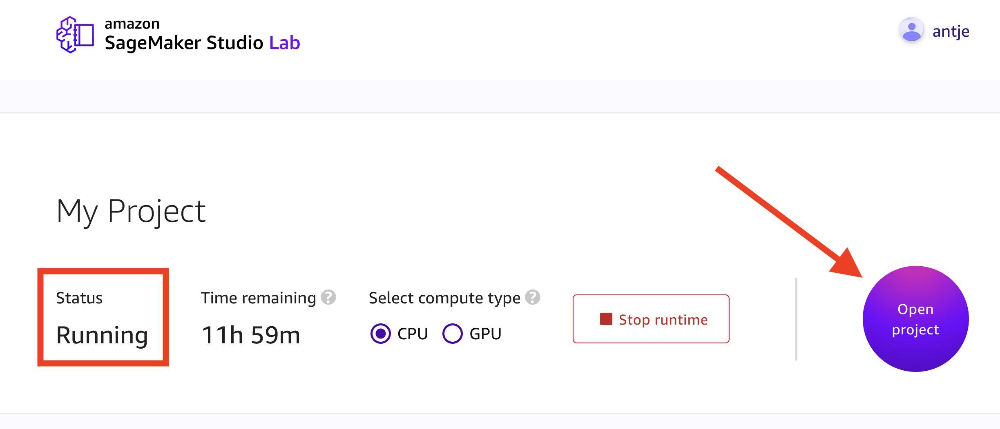

## 5. Launch a New Terminal within Studio Lab

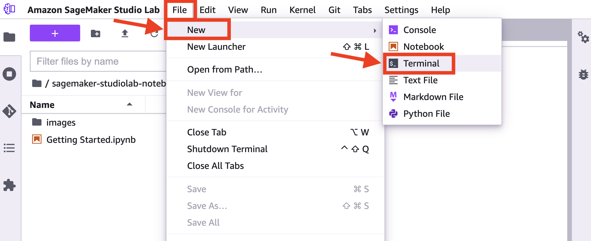

## 6. Clone this GitHub Repo in the Terminal

Within the Terminal, run the following:

```
cd ~ && git clone https://github.com/data-science-on-aws/oreilly_book
```

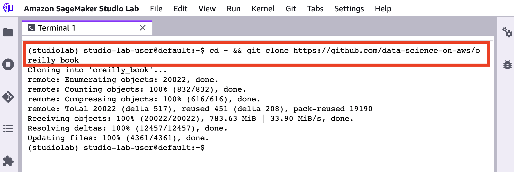

## 7. Create `data_science_on_aws` Conda kernel

Within the Terminal, run the following:

```
cd ~/oreilly_book/ && conda env create -f environment.yml || conda env update -f environment.yml && conda activate data_science_on_aws
```

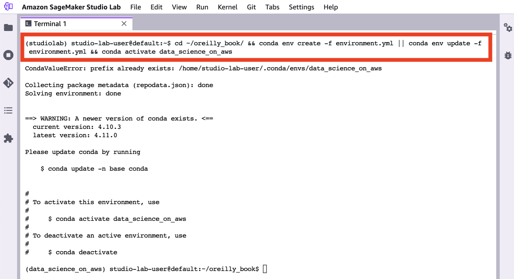

If you see an error like the following, just ignore it. This will appear if you already have an existing Conda environment with this name. In this case, we will update the environment. 

```
CondaValueError: prefix already exists: /home/studio-lab-user/.conda/envs/data_science_on_aws
```

## 8. Start the Workshop!

Navigate to `oreilly_book/00_quickstart/` in SageMaker Studio Lab and start the workshop! 

_You may need to refresh your browser if you don't see the new `oreilly_book/` directory._

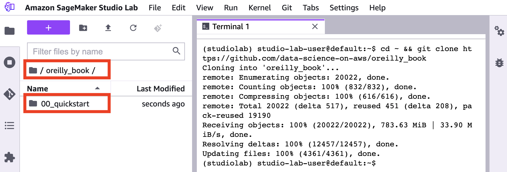

When you open the notebooks, make sure to select the `data_science_on_aws` kernel. 

