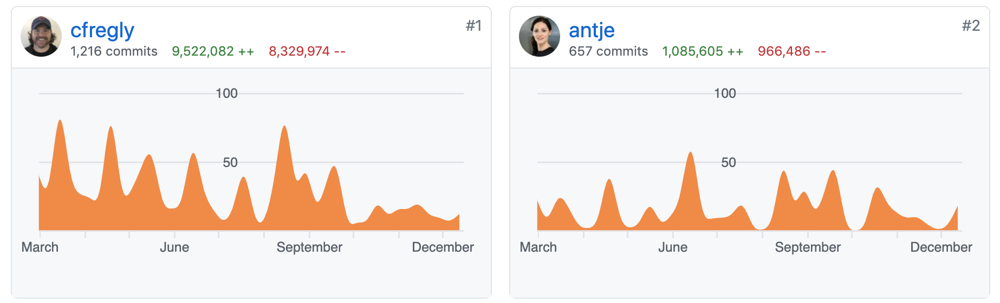
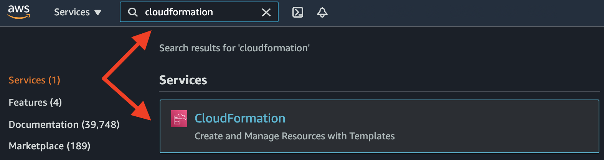
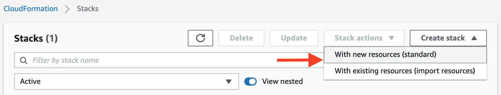
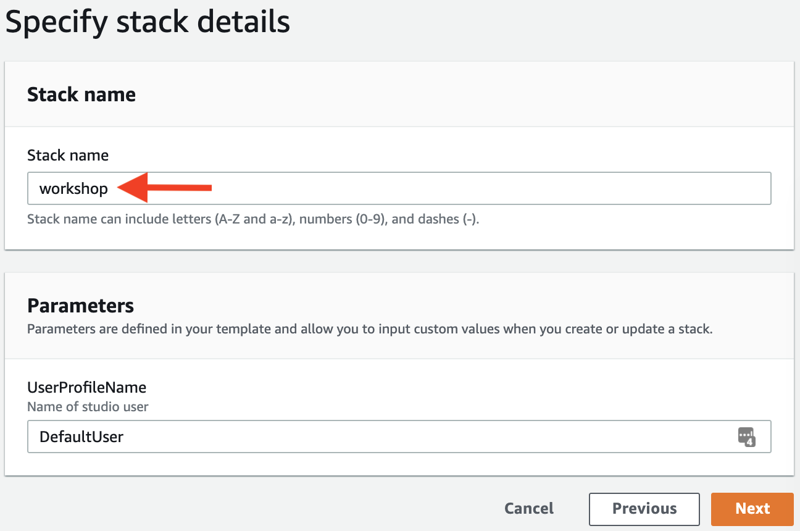
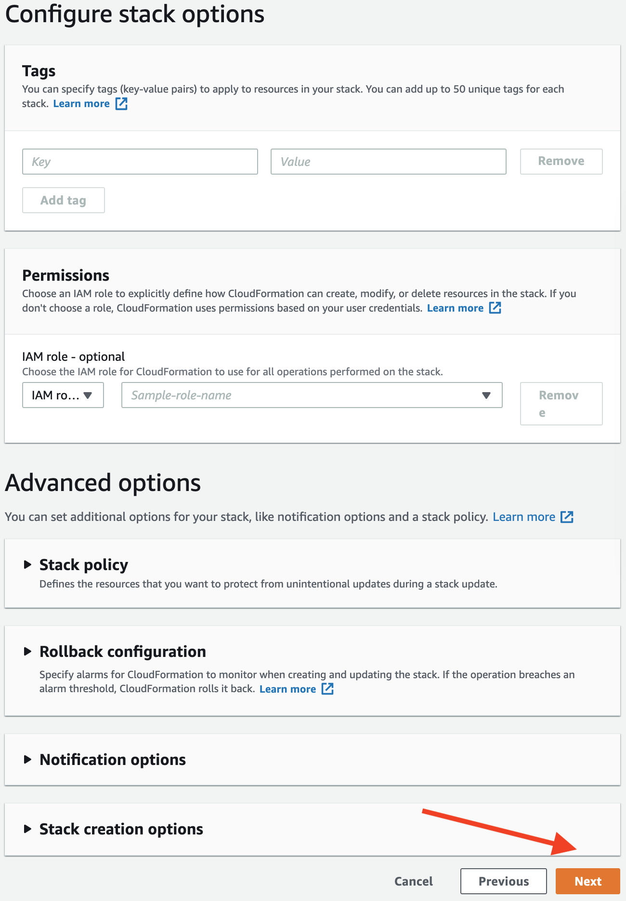
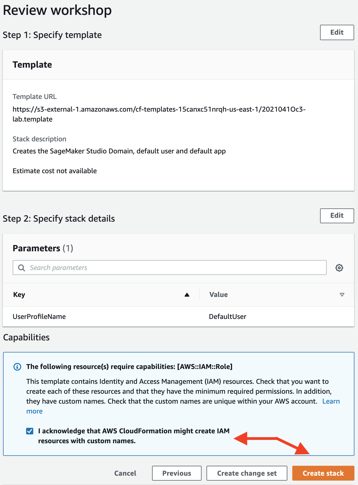

# O'Reilly Book Coming Early 2021

## Data Science on AWS

YouTube Videos, Meetups, Book, and Code:  **https://datascienceonaws.com**

[](https://datascienceonaws.com)

# Workshop Description
In this workshop, we build a natural language processing (NLP) model to classify sample Twitter comments and customer-support emails using the state-of-the-art [BERT](https://arxiv.org/abs/1810.04805) model for language representation.

To build our BERT-based NLP model, we use the [Amazon Customer Reviews Dataset](https://s3.amazonaws.com/amazon-reviews-pds/readme.html) which contains 150+ million customer reviews from Amazon.com for the 20 year period between 1995 and 2015.  In particular, we train a classifier to predict the `star_rating` (1 is bad, 5 is good) from the `review_body` (free-form review text).

# Workshop Cost
This workshop is FREE, but would otherwise cost <25 USD.


# Workshop Description


# Workshop Paths

## Quick Start (All-In-One Workshop Path)


## Additional Workshop Paths per Persona


# Workshop Contributors


# Workshop Instructions

## 1. Login to AWS Console


## 2. Setup Environment






### `lab.template` S3 URL <=================
```
https://dsoaws.s3.amazonaws.com/workshop/lab.template
```


### `lab.template` S3 URL <=================
```
https://dsoaws.s3.amazonaws.com/workshop/lab.template
```







## 3. Launch SageMaker Studio

Open the [AWS Management Console](https://console.aws.amazon.com/console/home)


In the AWS Console search bar, type `SageMaker` and select `Amazon SageMaker` to open the service console.


## 4. Launch a New Terminal within Studio

Click `File` > `New` > `Terminal` to launch a terminal in your Jupyter instance.


## 5. Clone this GitHub Repo in the Terminal

Within the Terminal, run the following:

```
cd ~ && git clone https://github.com/data-science-on-aws/workshop
```

If you see an error like the following, just re-run the command again until it works:
```
fatal: Unable to create '/home/sagemaker-user/workshop/.git/index.lock': File exists.

Another git process seems to be running in this repository, e.g.
an editor opened by 'git commit'. Please make sure all processes
are terminated then try again. If it still fails, a git process
may have crashed in this repository earlier:
remove the file manually to continue.
```
_Note:  This is not a fatal error ^^ above ^^.  Just re-run the command again until it works._

## 6. Start the Workshop!

Navigate to `00_quickstart/` in SageMaker Studio and start the workshop!

_You may need to refresh your browser if you don't see the new `workshop/` directory._


