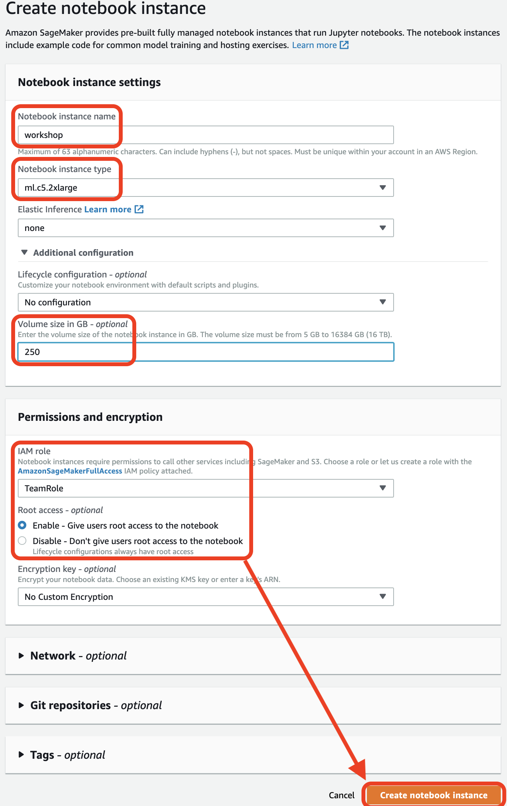
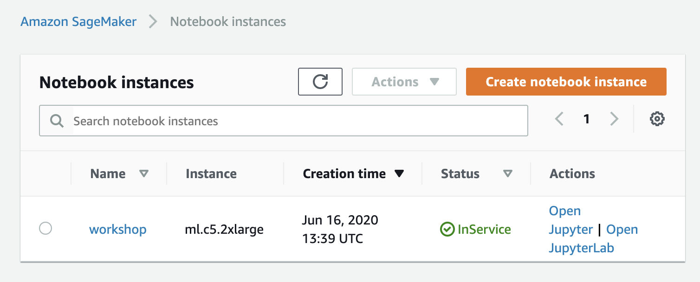
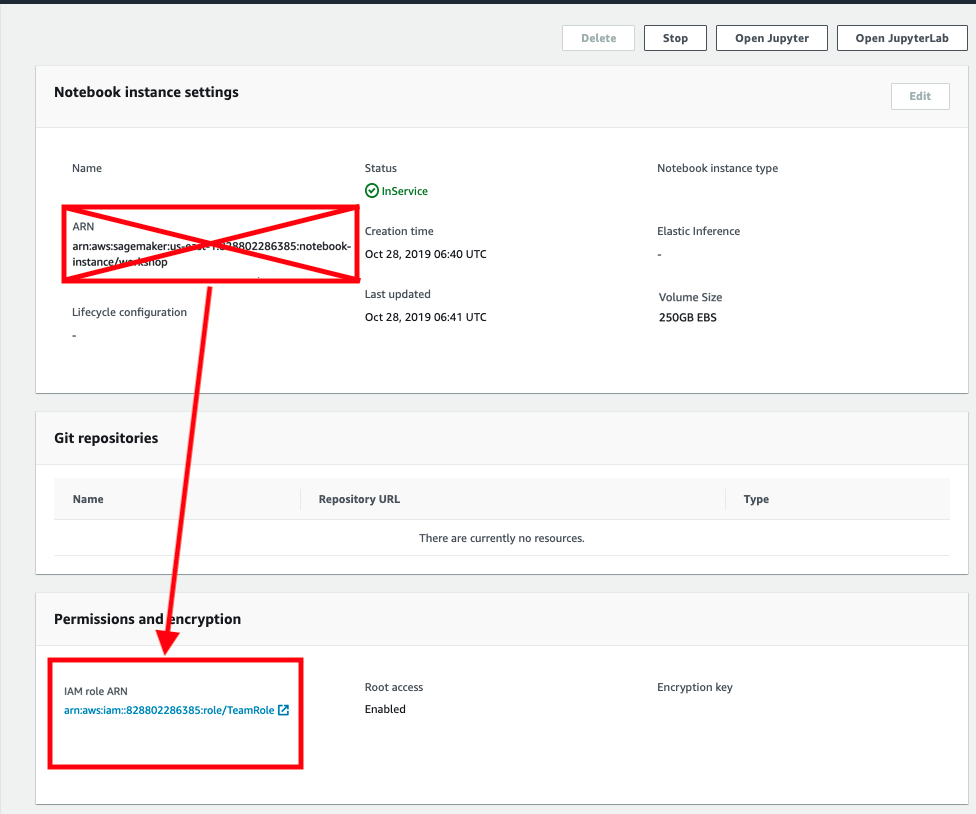
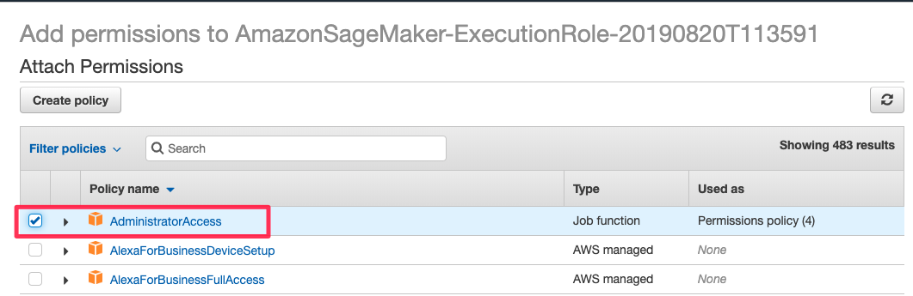

# Attend the Next Free Online Workshop!
RSVP Here:  **https://www.eventbrite.com/e/full-day-workshop-kubeflow-gpu-kerastensorflow-20-tf-extended-tfx-kubernetes-pytorch-xgboost-tickets-63362929227**

# Signup for our Upcoming O'Reilly Book, "Data Science on Amazon Web Services"
Signup Here:  https://datascienceonaws.com

Influence the book and take our quick survey here:  https://www.surveymonkey.com/r/798CMZ3


# Workshop Agenda
 

# Instructions for the Day of the Workshop

_This workshop creates an ephemeral AWS acccount for you to use only for this workshop.  This ephemeral account is not accessible after the workshop, however you can clone this repo and reproduce in your own AWS Account._

## 1. Logout of All AWS Consoles Across All Browser Tabs
If you don't logout, the following instructions will not work properly.

_Please logout of all AWS Console sessions in all browser tabs._

## 2. Login to the Workshop Portal (aka Event Engine)
_Note:  At the start of the workshop, we will provide each of your with a personalized link to your specific Workshop Portal environment._


Click on **AWS Console** on dashboard.


Take the defaults and click on **Open AWS Console**. This will open AWS Console in a new browser tab.

Double-check that your account name is something like `TeamRole/MasterKey` as follows:


If not, please logout of your AWS Console in all browser tabs and re-run the steps above!

## 3. Launch an Amazon SageMaker Notebook Instance

Open the [AWS Management Console](https://console.aws.amazon.com/console/home)

**Note:** This workshop has been tested on the US West (Oregon) (us-west-2) region. Make sure that you see **Oregon** on the top right hand corner of your AWS Management Console. If you see a different region, click the dropdown menu and select US West (Oregon).

In the AWS Console search bar, type `SageMaker` and select `Amazon SageMaker` to open the service console.


Select `Create notebook instance`.


In the Notebook instance name text box, enter a name for the notebook instance.

<!---  --->

For this workshop select `workshop` as the instance name.

Choose `ml.c5.2xlarge`. We'll only be using this instance to launch jobs. The training job themselves will run either on a SageMaker managed cluster or an Amazon EKS cluster.

Volume size `250` - this is needed to explore datasets, build docker containers, and more.  During training data is copied directly from Amazon S3 to the training cluster when using SageMaker.  When using Amazon EKS, we'll setup a distributed file system that worker nodes will use to get access to training data.


In the IAM role box, select the default `TeamRole`.


You must select the default `VPC`, `Subnet`, and `Security group` as shown in the screenshow.  Your values will likely be different.  This is OK.

Keep the default settings for the other options not highlighted in red, and click `Create notebook instance`.  On the `Notebook instances` section you should see the status change from `Pending` -> `InService`


While the notebook spins up, continue to work on the next section.  We'll come back to the notebook when it's ready.

## 4. Update IAM Role Policy

Click on the `notebook` instance to see the instance details.
`


Click on the IAM role link and navigate to the IAM Management Console.



Click `Attach Policies`.


              
Select `AdministratorAccess` and click on `Attach Policy`.

_Note:  Never do this in your production account.  Please follow a least-priviledge security model._ 



## 5. Start the Jupyter notebook

_Note:  Proceed when the status of the notebook instance changes from `Pending` to `InService`._


## 6. Launch a new Terminal within the Jupyter notebook

Click `File` > `New` > `Terminal` to launch a terminal in your Jupyter instance.


## 7. Clone this GitHub Repor in the Terminal

Within the Jupyter terminal, run the following:
```
cd ~/SageMaker

git clone https://github.com/data-science-on-aws/workshop
```

## 8. Start the Workshop!
Navigate to `01_setup/` in your Jupyter notebook and start the workshop!


