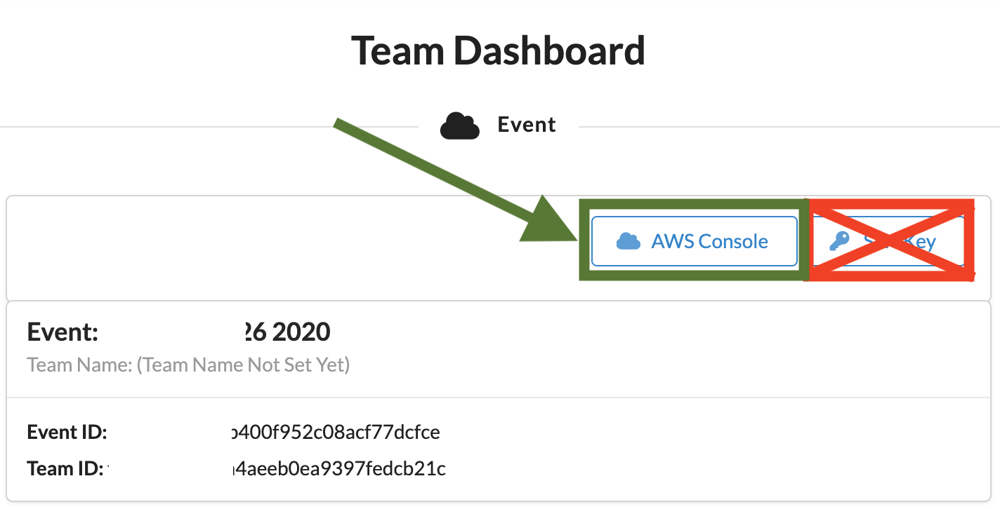
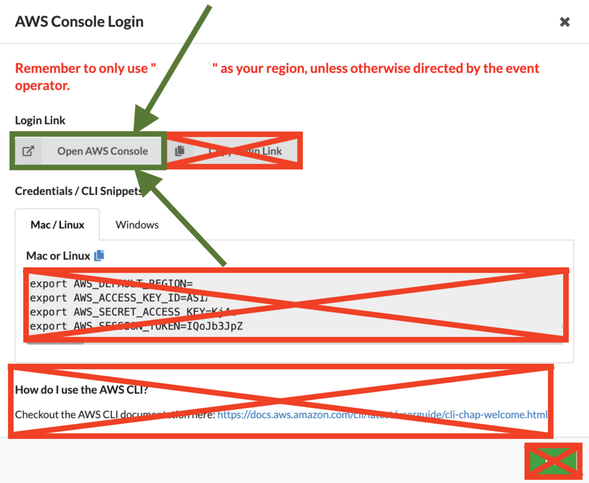
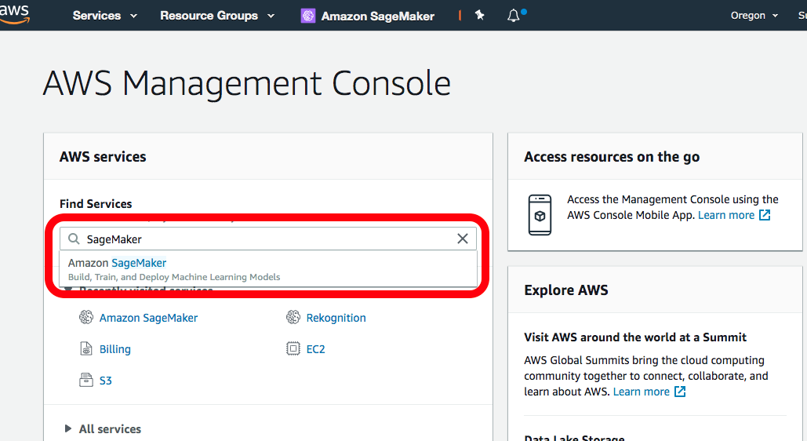
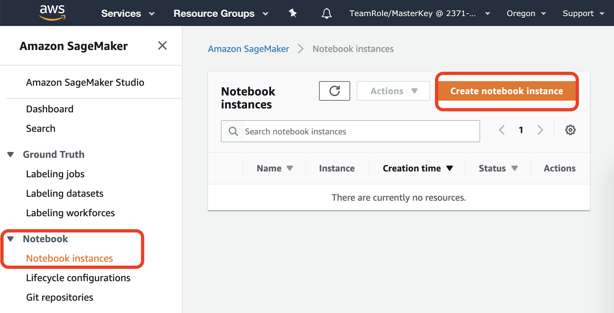
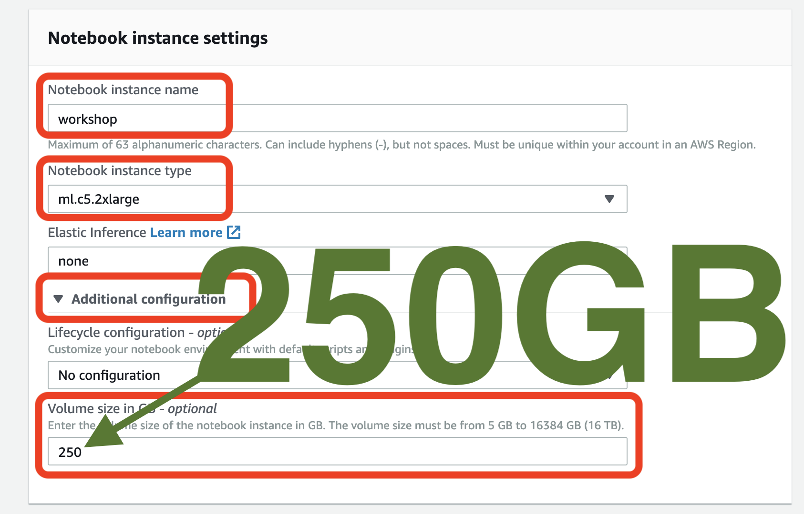
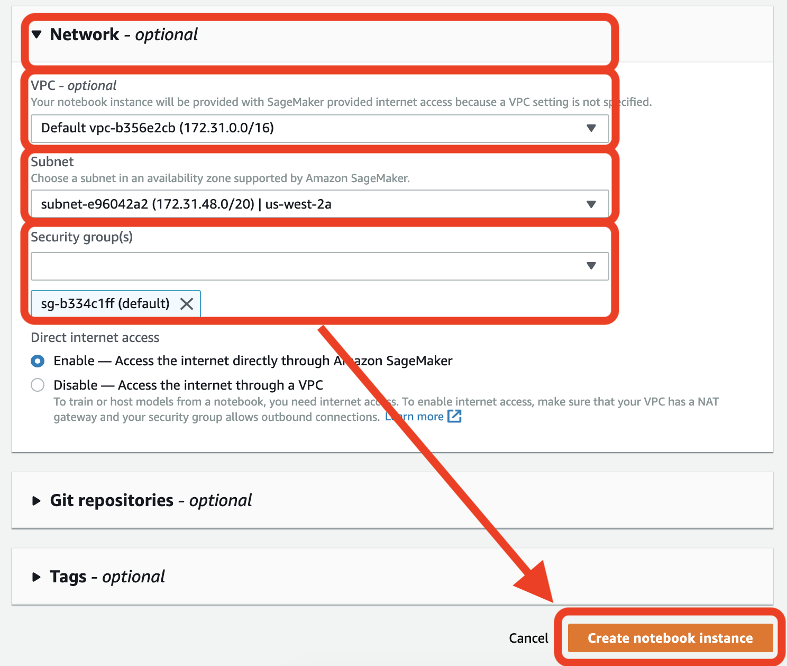

# Attend our Free, Online, Full-Day Workshop!
You must register on [**Eventbrite**](https://www.eventbrite.com/e/full-day-workshop-kubeflow-gpu-kerastensorflow-20-tf-extended-tfx-kubernetes-pytorch-xgboost-tickets-63362929227).  

_All instructions will come through Eventbrite.  Please make sure your Eventbrite email address is up to date._

# Upcoming O'Reilly Book:  _Data Science on Amazon Web Services_
Register for early access directly on our [**website**](https://datascienceonaws.com).

Request one of our [**talks**](https://datascienceonaws.com/talks) for your conference or meetup.

_Influence the book by filling out our [**quick survey**](https://www.surveymonkey.com/r/798CMZ3)._

[](https://datascienceonaws.com)

# Workshop Cost - FREE

This workshop is FREE, but would otherwise cost <25 USD.


# Workshop Agenda
[](https://www.eventbrite.com/e/full-day-workshop-kubeflow-gpu-kerastensorflow-20-tf-extended-tfx-kubernetes-pytorch-xgboost-tickets-63362929227)

# Workshop Instructions
_Note:  This workshop will create an ephemeral AWS acccount for each attendee.  This ephemeral account is not accessible after the workshop.  You can, of course, clone this GitHub repo and reproduce the entire workshop in your own AWS Account._

## 1. Logout of All AWS Consoles Across All Browser Tabs
If you do not logout of existing AWS Consoles, things will not work properly.

_Please logout of all AWS Console sessions in all browser tabs._


## 2. Login to the Workshop Portal (aka Event Engine)

**If you are registered on Eventbrite, you will receive a link to the Workshop 1 hour before the event.**  

**The email with the link will come through Eventbrite.**

**Please make sure your Eventbrite email is up to date.**



Click on **AWS Console** on dashboard.



Take the defaults and click on **Open AWS Console**. This will open AWS Console in a new browser tab.

Double-check that your account name is something like `TeamRole/MasterKey` as follows:


If not, please logout of your AWS Console in all browser tabs and re-run the steps above!


## 3. Launch an Amazon SageMaker Notebook Instance

Open the [AWS Management Console](https://console.aws.amazon.com/console/home)

**Note:** This workshop has been tested on the US West (Oregon) (us-west-2) region. Make sure that you see **Oregon** on the top right hand corner of your AWS Management Console. If you see a different region, click the dropdown menu and select US West (Oregon).

In the AWS Console search bar, type `SageMaker` and select `Amazon SageMaker` to open the service console.



Select `Create notebook instance`.



In the Notebook instance name text box, enter `workshop`.

Choose `ml.c5.2xlarge`. We'll only be using this instance to launch jobs. The training job themselves will run either on a SageMaker managed cluster or an Amazon EKS cluster.

Volume size `250` - this is needed to explore datasets, build docker containers, and more.  During training data is copied directly from Amazon S3 to the training cluster when using SageMaker.  When using Amazon EKS, we'll setup a distributed file system that worker nodes will use to get access to training data.



In the IAM role box, select the default `TeamRole`.


You must select the default `VPC`, `Subnet`, and `Security group` as shown in the screenshow.  Your values will likely be different.  This is OK.

Keep the default settings for the other options not highlighted in red, and click `Create notebook instance`.  On the `Notebook instances` section you should see the status change from `Pending` -> `InService`




## 4. Start the Jupyter notebook

_Note:  Proceed when the status of the notebook instance changes from `Pending` to `InService`._


## 5. Launch a new Terminal within the Jupyter notebook

Click `File` > `New` > `Terminal` to launch a terminal in your Jupyter instance.


## 6. Clone this GitHub Repo in the Terminal

Within the Jupyter terminal, run the following:
```
cd ~/SageMaker && git clone https://github.com/data-science-on-aws/workshop
```


## 7. Navigate Back to Notebook View


## 8. Start the Workshop!
Navigate to `01_intro/` in your Jupyter notebook and start the workshop!


# Disclaimer
* The content provided in this repository is for demonstration purposes and not meant for production. You should use your own discretion when using the content.
