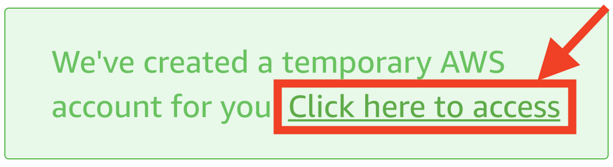
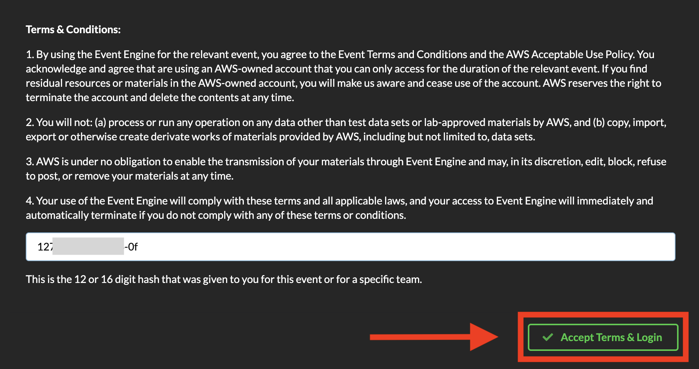
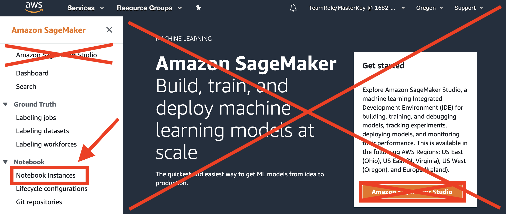
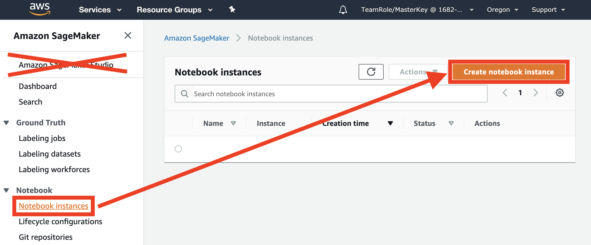
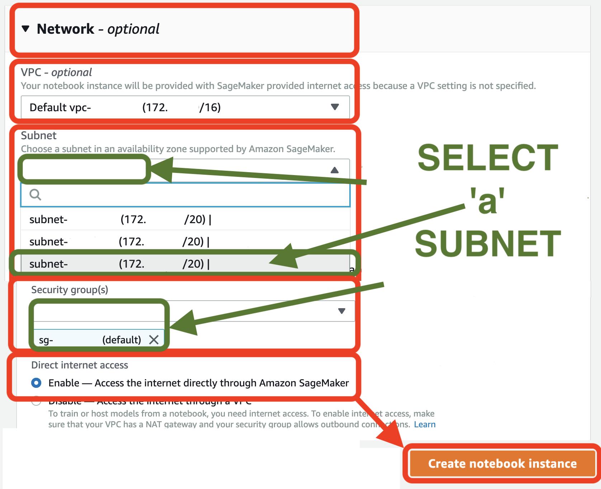
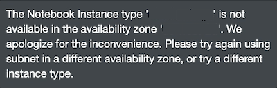

# Upcoming O'Reilly Book:  _Data Science on AWS_
Register for early access directly on our [**website**](https://datascienceonaws.com).

[](https://datascienceonaws.com)

# Workshop Instructions
_Note:  This workshop will create an ephemeral AWS acccount for each attendee.  This ephemeral account is not accessible after the workshop.  You can, of course, clone this GitHub repo and reproduce the entire workshop in your own AWS Account._


## 1. Login to the Workshop Portal (aka Event Engine). 

. 

. 

. 

## 2. Login to the **AWS Console**


Take the defaults and click on **Open AWS Console**. This will open AWS Console in a new browser tab.

If you see this message, you need to logout from any previously used AWS accounts.


_Please logout of all AWS Console sessions in all browser tabs._


Double-check that your account name is something like `TeamRole/MasterKey` as follows:


If not, please logout of your AWS Console in all browser tabs and re-run the steps above!


## 3. Launch a SageMaker Notebook Instance

Open the [AWS Management Console](https://console.aws.amazon.com/console/home)

**Note:** This workshop has been tested on the US West (Oregon) (us-west-2) region. Make sure that you see **Oregon** on the top right hand corner of your AWS Management Console. If you see a different region, click the dropdown menu and select US West (Oregon).

In the AWS Console search bar, type `SageMaker` and select `Amazon SageMaker` to open the service console.

. 

Select `Create notebook instance`.

.



In the Notebook instance name text box, enter `workshop`.

Choose `ml.c5.2xlarge`. We'll only be using this instance to launch jobs. The training job themselves will run either on a SageMaker managed cluster or an Amazon EKS cluster.

Volume size `250` - this is needed to explore datasets, build docker containers, and more.  During training data is copied directly from Amazon S3 to the training cluster when using SageMaker.  When using Amazon EKS, we'll setup a distributed file system that worker nodes will use to get access to training data.


In the IAM role box, select the default `TeamRole`.


You must select the default `VPC`, `Subnet`, and `Security group` as shown in the screenshow.  Your values will likely be different.  This is OK.

Keep the default settings for the other options not highlighted in red, and click `Create notebook instance`.  On the `Notebook instances` section you should see the status change from `Pending` -> `InService`



In case you see a message like the following please delete the notebook instance and re-create the notebook instance selecting the subnet-a in the VPC settings. 




## 4. Start the Jupyter Notebook

_Note:  Proceed when the status of the notebook instance changes from `Pending` to `InService` after a few minutes._


## 5. Launch a New Terminal within the Jupyter Notebook

Click `File` > `New` > [...scroll down...] `Terminal` to launch a terminal in your Jupyter instance.


## 6. Clone this GitHub Repo in the Terminal

Within the Jupyter terminal, run the following:

```
cd ~/SageMaker && git clone https://github.com/data-science-on-aws/workshop
```


## 7. Navigate Back to Notebook View


## 8. Start the Workshop!
Navigate to `01_setup/` in your Jupyter notebook and start the workshop!

_You may need to refresh your browser if you don't see the new `workshop/` directory._


