# Upcoming O'Reilly Book:  _Data Science on Amazon Web Services_
Register for early access directly on our [**website**](https://datascienceonaws.com).

Request one of our [**talks**](https://datascienceonaws.com/talks) for your conference or meetup.

_Influence the book by filling out our [**quick survey**](https://www.surveymonkey.com/r/798CMZ3)._

[](https://datascienceonaws.com)

# Workshop Agenda


# Workshop Instructions

## 1. Click on AWS Console

Take the defaults and click on **Open AWS Console**. This will open AWS Console in a new browser tab.


Double-check that your account name is something like `IibsAdminAccess-DO-NOT-DELETE...` as follows:


If not, please logout of your AWS Console in all browser tabs and re-run the steps above!

## 2. Create `TeamRole` IAM Role


## 3. Launch an Amazon SageMaker Notebook Instance

Open the [AWS Management Console](https://console.aws.amazon.com/console/home)


In the AWS Console search bar, type `SageMaker` and select `Amazon SageMaker` to open the service console.

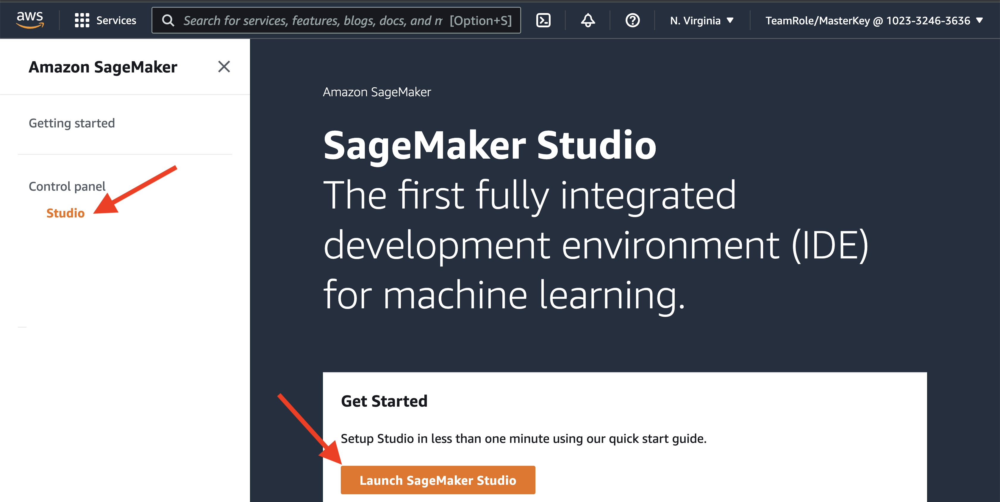

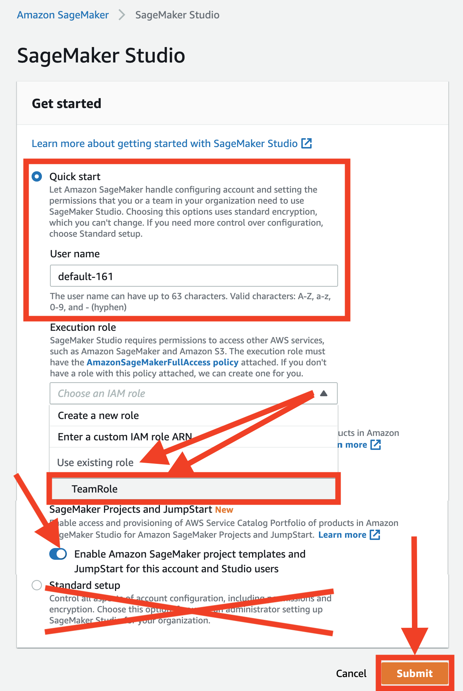

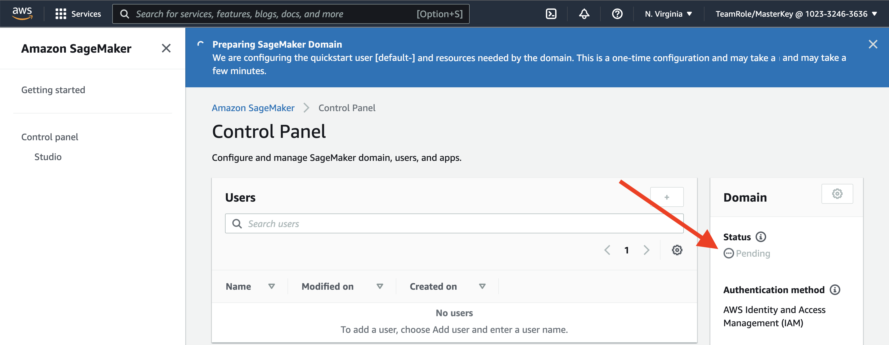

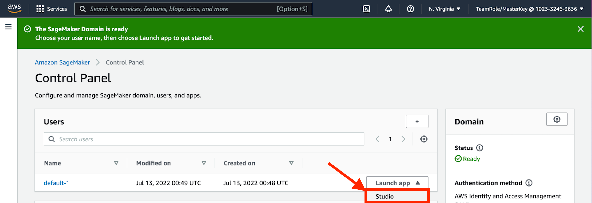


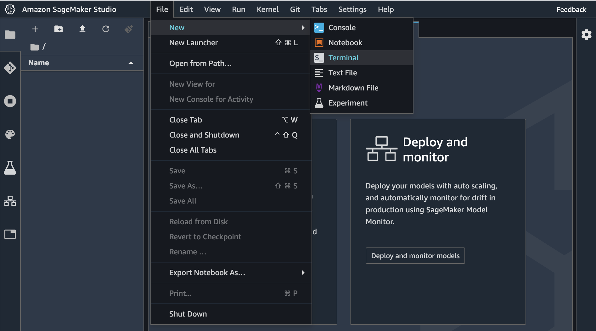

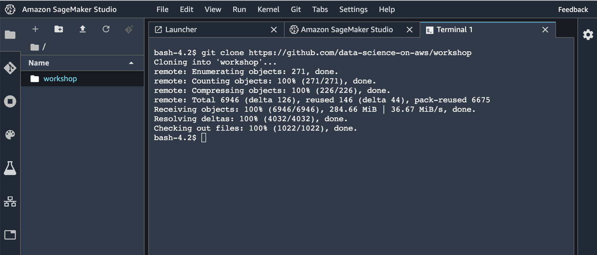

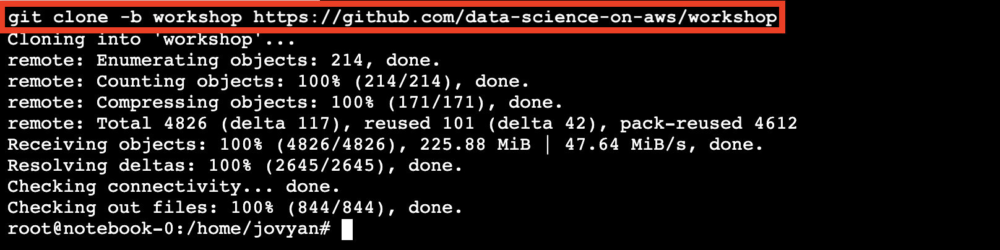

## 4. Update IAM Role Policy


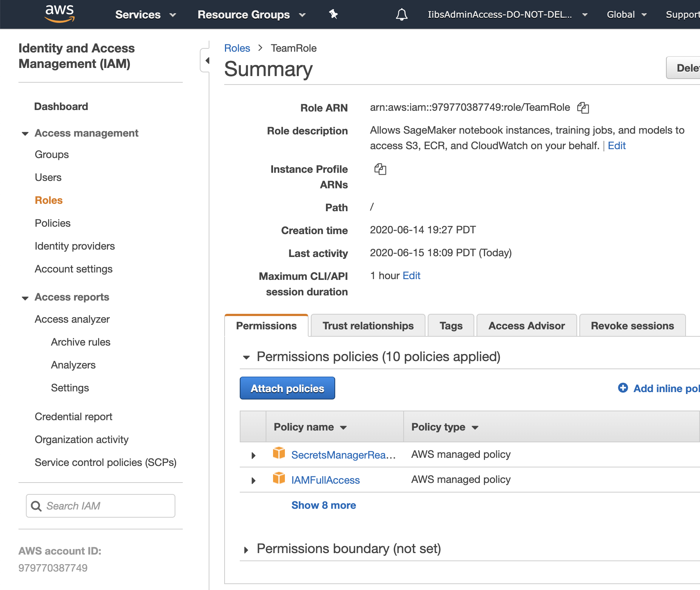

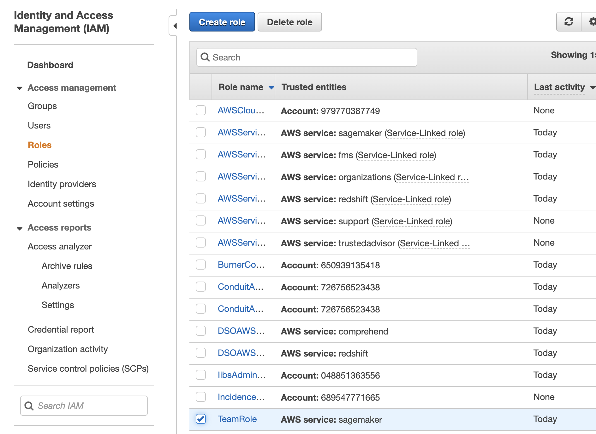

Click `Attach Policies`.

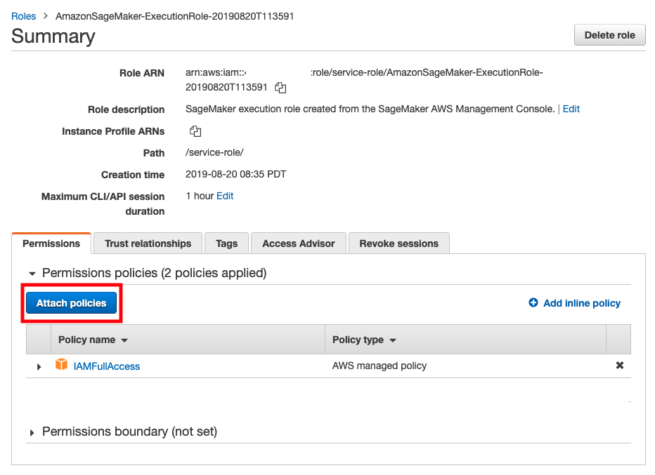
              
Select `AmazonS3FullAccess` and click on `Attach Policy`.

_Note:  Reminder that you should allow access only to the resources that you need._ 


## 4. Start the Jupyter notebook

_Note:  Proceed when the status of the notebook instance changes from `Pending` to `InService`._

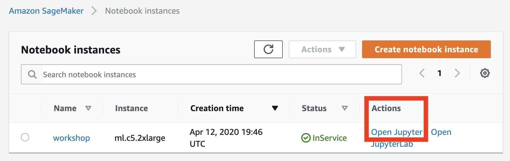

## 5. Launch a new Terminal within the Jupyter notebook

Click `File` > `New` > `Terminal` to launch a terminal in your Jupyter instance.


## 6. Clone this GitHub Repo in the Terminal

Within the Jupyter terminal, run the following:
```
cd ~/SageMaker && git clone https://github.com/data-science-on-aws/workshop
```


## 7. Navigate Back to Notebook View


## 8. Start the Workshop!
Navigate to `01_intro/` in your Jupyter notebook and start the workshop!


# Disclaimer
* The content provided in this repository is for demonstration purposes and not meant for production. You should use your own discretion when using the content.
