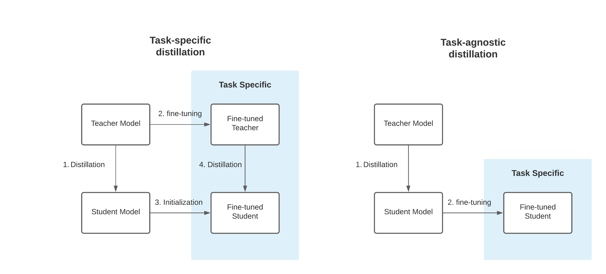

# Task-specific knowledge distillation with BERT, Transformers & Amazon SageMaker

This Repository contains to Notebooks: 

* [knowledge-distillation](knowledge-distillation.ipynb) a step-by-step example on how distil the knowledge from the teacher to the student.
* [sagemaker-distillation](sagemaker-distillation.ipynb) a derived version of the first notebook, which shows how to scale your training for automatic HPO using Amazon SageMaker.

---

Welcome to our end-to-end task-specific knowledge distilattion Text-Classification example using Transformers, PyTorch & Amazon SageMaker. Distillation is the process of training a small "student" to mimic a larger "teacher". In this example, we will use [BERT-base](https://huggingface.co/textattack/bert-base-uncased-SST-2) as Teacher and [BERT-Tiny](https://huggingface.co/google/bert_uncased_L-2_H-128_A-2) as Student. We will use [Text-Classification](https://huggingface.co/tasks/text-classification) as task-specific knowledge distillation task and the [Stanford Sentiment Treebank v2 (SST-2)](https://paperswithcode.com/dataset/sst) dataset for training.

They are two different types of knowledge distillation, the Task-agnostic knowledge distillation (right) and the Task-specific knowledge distillation (left). In this example we are going to use the Task-specific knowledge distillation. 

_Task-specific distillation (left) versus task-agnostic distillation (right). Figure from FastFormers by Y. Kim and H. Awadalla [arXiv:2010.13382]._

In Task-specific knowledge distillation a "second step of distillation" is used to "fine-tune" the model on a given dataset. This idea comes from the [DistilBERT paper](https://arxiv.org/pdf/1910.01108.pdf) where it was shown that a student performed better than simply finetuning the distilled language model:

> We also studied whether we could add another step of distillation during the adaptation phase by fine-tuning DistilBERT on SQuAD using a BERT model previously fine-tuned on SQuAD as a teacher for an additional term in the loss (knowledge distillation). In this setting, there are thus two successive steps of distillation, one during the pre-training phase and one during the adaptation phase. In this case, we were able to reach interesting performances given the size of the model:79.8 F1 and 70.4 EM, i.e. within 3 points of the full model.

If you are more interested in those topics you should defintely read: 
* [DistilBERT, a distilled version of BERT: smaller, faster, cheaper and lighter](https://arxiv.org/abs/1910.01108)
* [FastFormers: Highly Efficient Transformer Models for Natural Language Understanding](https://arxiv.org/abs/2010.13382)

Especially the [FastFormers paper](https://arxiv.org/abs/2010.13382) contains great research on what works and doesn't work when using knowledge distillation.

---

